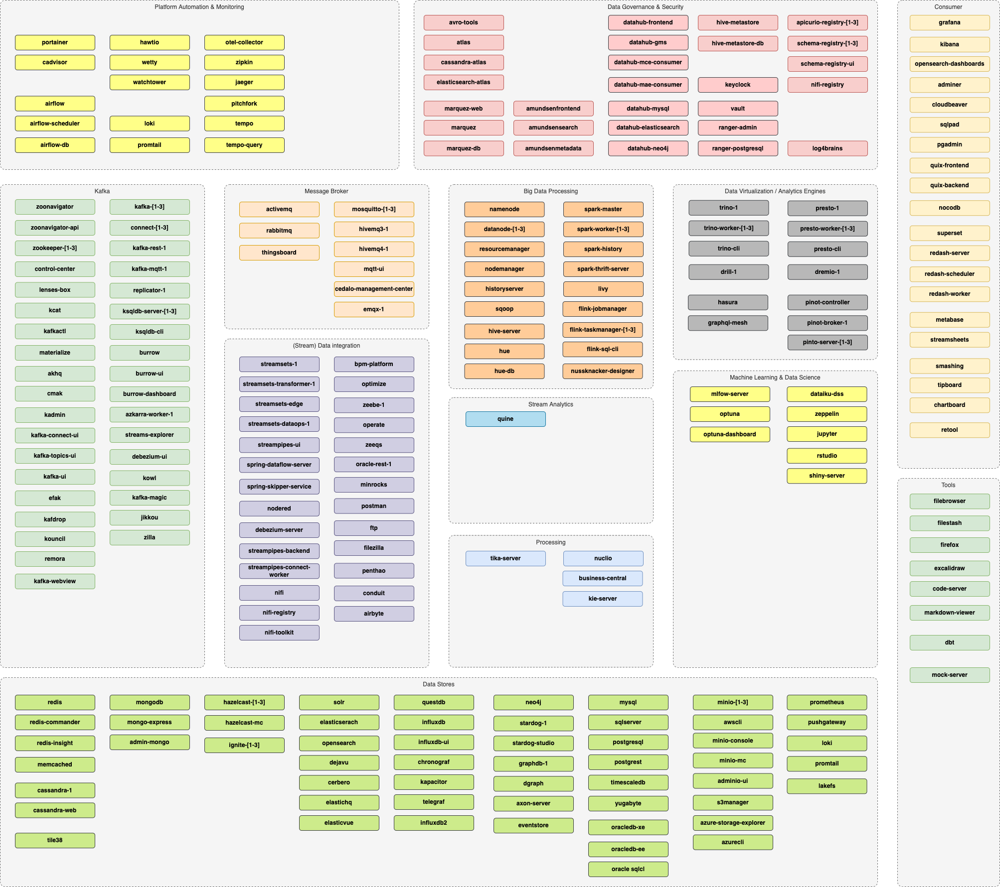

# Pila de plataforma: `modern-data-platform` - v1.15.0

Esta pila de plataforma define el conjunto de servicios para una plataforma de datos moderna, como

*   Kafka
*   Spark
*   Ecosistema de Hadoop
*   StreamSets y NiFi
*   Zeppelin & Jupyter
*   NoSQL

y muchos otros.

## ¿Qué servicios puedo utilizar?

Los siguientes servicios se proporcionan como parte de la Plataforma de Datos Moderna:

Para que se agreguen nuevos servicios, cree un [Problema de GitHub](https://github.com/TrivadisPF/modern-data-analytics-stack/issues/new) o cree una solicitud de extracción.

## Cambios

Ver [¿Qué hay de nuevo?](./documentation/changes.md) para obtener una lista detallada de los cambios.

## Documentación

*   [Introducción a `platys` y `modern-data-platform` pila](./documentation/getting-started.md)
*   [Configuración](./documentation/configuration.md) - todos los ajustes configurables en el `config.yml`
*   [Tutoriales](./tutorials/README.md) - varios tutoriales instrucciones detalladas sobre cómo trabajar con `platys`
*   [Cocina](./cookbooks/README.md) - varias recetas que muestran cómo usar características específicas de `platys`
*   [Mapeo de puertos](./documentation/port-mapping.md)
*   [Preguntas Frecuentes](./documentation/faq.md)
*   [Solución de problemas](./documentation/troubleshooting.md)
*   [Agregar servicios adicionales no compatibles con una pila de plataforma](https://github.com/TrivadisPF/platys/blob/master/documentation/docker-compose-override.md)
*   [Cómo usar una pila generada por platys sin Internet](https://github.com/TrivadisPF/platys/blob/master/documentation/docker-compose-without-internet.md)
*   [Actualizar a una nueva versión de pila de plataforma](https://github.com/TrivadisPF/platys/blob/master/documentation/upgrade-platform-stack.md)
