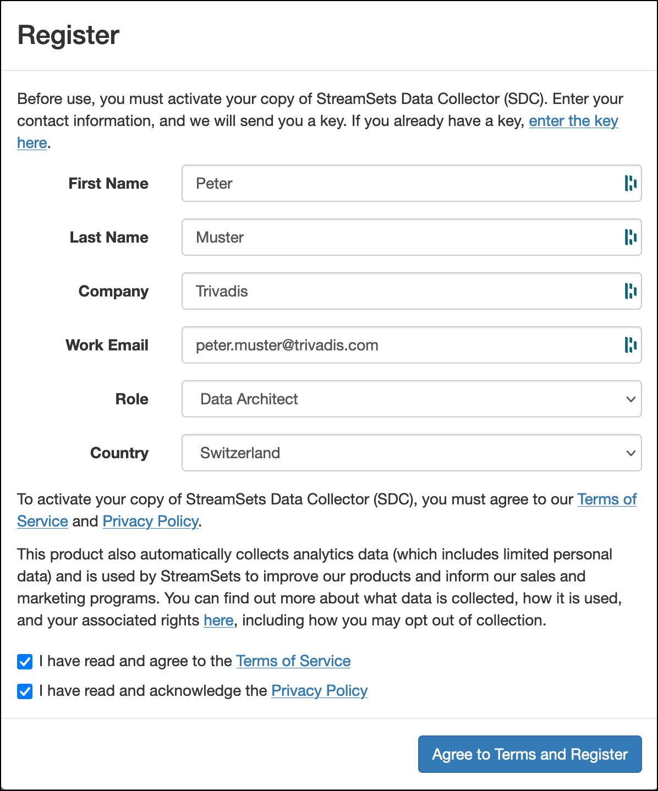

# Support StreamSets Data Collector Activation

This recipe will show how to support activation of StreamSets Data Collector in persistent and replayable way.

The problem with the activation of StreamSets is, that an activation code is given for a given `SDC ID` (a.k.a product id). If you restart the StreamSets Data Collector container, everything is fine, but if you stop, remove and recrate the container, a new `SDC ID` is generated and you have to re-activate StreamSets. 

This recipe shows, how the `SDC ID` can be fixed to a value, so that recreating a container won't change it. 

## Initialise data platform

First [initialise a platys-supported data platform](../documentation/getting-started.md) with the following services enabled

```
platys init --enable-services STREAMSETS -s trivadis/platys-modern-data-platform -w 1.13.0
```

Edit the `config.yml` and add the following configuration settings.

```
      STREAMSETS_http_authentication: 'form'
      STREAMSETS_sdc_id: ''
```

Now generate data platform 

```
platys gen
```

and then start the platform:

```
docker-compose up -d
```

## Activate StreamSets

Navigate to <http://dataplatform:18630> and login with **user** set to `admin` and **password** set to `admin`.

Click on **Enter a Code** and on the **Activation** page click on **Back**. The **Register** page should be shown. 



Fill out all the fields and click on **Agree to Terms and Register**.

Check your email inbox, after a short while you should get and email with an Activation Code. 

Copy the section within `--------SDC ACTIVATION CODE--------` (example below has been tampered, so it is no longer usable)

```
--------SDC ACTIVATION CODE--------
xcvxcvcxvxvxcvxcvxvxvxvsdfsfsfsf=::SHA512withRSA::mCcgFI2MFomlqWG7bHl/JTKEbMw7rSG2jtwK7QO4eS9+Om+Tw9D6lB39qrUd3GGAgNV8yqECsSgxmrUCjzP8d9F3TkeStJtiIjvIuCd+q+pafbUwg3QfMtc+xn8MxtWpTBdyDESoxVLd3qy4Heje1hKWXpZyL4VcvxcvxcvcxvmJJia/6FYNI787Fn30Evxo9Lr4vCXrB4jY+3mFbzJy1G64ZJgF7fRz8RNe3D0XwklhemcmbX0c8i+82qdCIU58b/xvl+n+RwyFC9F6sVBfEDVAS9aQJu99EkF+Nm0aHtp8GAaNEOwi6nYCInAboetDTNqZxkaopwAXogGB/0r88+gqO+Dx8ce8a60hRoRX/8fqqr4ZtPin9WQrxPLdiSCcUZLQs/0r88+gqO+Dx8ce8a60hRoRX/8fqqr4ZtPin9WQrxPLdiSCcUZLQs/0r88+gqO+Dx8ce8a60hRoRX/8fqqr4ZtPin9WQrxPLdiSCcUZLQs/zx8svPy1YWpLR5fj8wQXSt3uGBi+pdalivMzazxcvxxcvxcxvvxxcvxcvGNrdJlvLSf70ugQzp6oMrm1edZHzsX9MPNliRyFMGhVsBB8tot3sZW4xVPOYaR3ndXRHVMUYtkU8fOMBFBnaF7XYKmTe4cLaAHTMDYaev32d/8ZMt09BMAjv32IqEhBjp6YZvVkYs2wbcX35EPOxcvxvxvccxvxxvxvcRdtBQWvwJXghFqa0aa+Ln3pYW1z7L1pKlWj4kViqex06BfVAlwSlj8I7CG0RBPth4dLDJPQPbVrpU4nKJHGZIr7THJxpB133PZrXr6JI15DyYk5xnURve5F0=
--------SDC ACTIVATION CODE--------
```

and paste it into the **Activation Code** field on the **Activation** screen. Take note of the product id shown above the **Activation Code** (will use that in the next section).  


Make sure that you replace both `SDC ACTIVATION CODE` with `SDC ACTIVATION KEY` and click on **Activate**. The window should close and on another pop-up dialog you should be able to click on **Reload** to finish activation of StreamSets. 

## Fix SDC ID to the value used for the Activation

Now we will enter the `SDC ID` (product id) into the `config.yml` so that it "surrive" a container stop and remove. 

To get the right value, you can check the log or use the value from the Activation page before.

To retrieve it from the log, perform

```
docker-compose logs -f streamsets-1 | grep "SDC ID"
```

you should see an output similar to the one below

```
docker@ubuntu:~/platys-cookbook$ docker-compose logs -f streamsets-1 | grep "SDC ID"
streamsets-1         | 2021-07-06 19:49:59,955 [user:] [pipeline:] [runner:] [thread:main] [stage:] 
INFO  Main -   SDC ID        : 577164ca-de93-11eb-818c-892d3b5f064a
```

Copy the SDC ID info `577164ca-de93-11eb-818c-892d3b5f064a` and paste it into the `STREAMSETS_sdc_id` of the `config.yml`.

```
STREAMSETS_sdc_id: '577164ca-de93-11eb-818c-892d3b5f064a'
```

Regenerate the stack

```
platys gen
```

restart docker-compose

```
docker-compose up -d
```

and the follwing output should be shown on the console

```
Recreating streamsets-1 ... 
wetty is up-to-date
Recreating streamsets-1    ... done
Starting markdown-renderer ... done
```

As you can see, the `streamsets-1` container will be re-created, using the same `SDC ID` as before. 

When reloading the StreamSets UI, you will have to re-activate, but you can now use the exact same Activation Code as before. 
