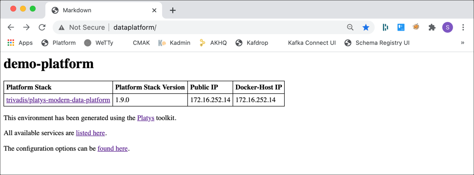
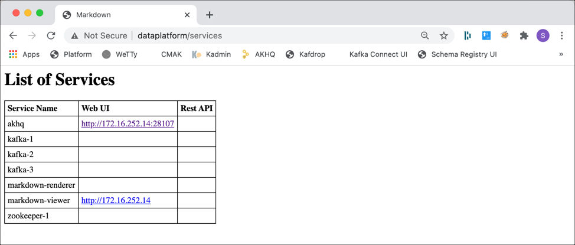

# Introducción a `platys` y `modern-data-platform` pila

En esta página se genera una plataforma sencilla que se basa en el `modern-data-platform` y luego se puede ejecutar usando Docker Compose.

La plataforma que crearemos aquí, utiliza Kafka y Zookeeper, pero el proceso debe ser comprensible incluso si no ha trabajado con Kafka antes.

## Prerrequisitos

Asegúrese de que ya ha instalado el [Motor docker](https://docs.docker.com/install/), [Docker Componer](https://docs.docker.com/compose/install/) y el [`platys`](https://github.com/TrivadisPF/platys/blob/master/documentation/install.md) conjunto de herramientas.

## Paso 1: Inicializar el entorno

Primero cree un directorio, que contendrá el `platys` configuración, así como los artefactos generados:

```bash
mkdir platys-demo-platform
cd platys-demo-platform
```

Ahora vamos a inicializar el directorio actual para usar la pila de la plataforma de análisis de datos moderno.

Especificamos el nombre de la pila de la plataforma `trivadis/platys-modern-data-platform` para usar, así como la versión de pila `1.16.0` (la versión actual de esta pila de plataformas).

Con el `-n` opción le damos a la plataforma un nombre significativo. Se utilizará como nombre de la red docker, por lo que es importante que sea único, si utiliza varias plataformas en la misma máquina.

```bash
platys init -n demo-platform --stack trivadis/platys-modern-data-platform --stack-version 1.16.0 --structure flat
```

Esto genera un `config.yml` , si no existe ya, con todos los servicios que se pueden configurar para la plataforma.

    Running using config file [config.yml]
    {"status":"Pulling from trivadis/platys-modern-data-platform","id":"1.16.0"}
    {"status":"Digest: sha256:4b3278aba39bcdeb43a1aefe1b17fe2edd6facf2843df64db104f6d850392dbe"}
    {"status":"Status: Image is up to date for trivadis/platys-modern-data-platform:1.16.0"}
      ______     _                 ___
     /_  __/____(_)   ______ _____/ (_)____
      / / / ___/ / | / / __ `/ __  / / ___/
     / / / /  / /| |/ / /_/ / /_/ / (__  )
    /_/ /_/  /_/ |___/\__,_/\__,_/_/____/
        __  ___          __                   ____        __           ____  __      __  ____
       /  |/  /___  ____/ /__  _________     / __ \____ _/ /_____ _   / __ \/ /___ _/ /_/ __/___  _________ ___
      / /|_/ / __ \/ __  / _ \/ ___/ __ \   / / / / __ `/ __/ __ `/  / /_/ / / __ `/ __/ /_/ __ \/ ___/ __ `__ \
     / /  / / /_/ / /_/ /  __/ /  / / / /  / /_/ / /_/ / /_/ /_/ /  / ____/ / /_/ / /_/ __/ /_/ / /  / / / / / /
    /_/  /_/\____/\__,_/\___/_/  /_/ /_/  /_____/\__,_/\__/\__,_/  /_/   /_/\__,_/\__/_/  \____/_/  /_/ /_/ /_/

    Congratulations! Your new Platform has been initialized in %path%

    Just a few more steps and you're ready to go:

    1. Edit the config.yml and enable the services you want to use.
    2. Some services also allow for properties to be controlled. Use them if needed.
    3. Generate the stack according to the settings done in step 1 by running "platys gen".

    Visit https://github.com/trivadispf/modern-data-platform-stack/blob/master/documentation/getting-started.md for quickstart guide and full documentation.%!(EXTRA string=config.yml)

## Paso 2: Configurar la plataforma

Ahora podemos configurar la plataforma, utilizando el `config.yml` archivo que ha sido creado por el `init` arriba.

En un editor (es decir, `nano`) abra este archivo de configuración.

    nano config.yml

Puede ver las opciones de configuración, disponibles a través de esta pila de plataforma, similar a esta (solo mostrando las primeras líneas):

          # Default values for the generator
          # this file can be used as a template for a custom configuration
          # or to know about the different variables available for the generator
          platys:
              platform-name: 'demo-platform'
              platform-stack: 'trivadis/platys-modern-data-platform'
              platform-stack-version: '1.16.0'
              structure: 'flat'
          # ========================================================================
          # Global configuration, valid for all or a group of services 
          # ========================================================================
          # Timezone, use a Linux string such as Europe/Zurich or America/New_York
          use_timezone: ''
          # the name of the repository to use for private images, which are not on docker hub (currently only Oracle images)
          private_docker_repository_name: 'trivadis'
          # the UID to use when using the "user" property in a service to override the user inside the container
          uid: '1000'
          # ========================================================================
          # External Services
          # ========================================================================
          external:
              KAFKA_enable: false
              KAFKA_bootstrap_servers:
              KAFKA_username:
              KAFKA_password:
              SCHEMA_REGISTRY_enable: false
              SCHEMA_REGISTRY_url:
              S3_enable: false
              S3_endpoint:
              S3_path_style_access: false
              S3_access_key:
          # ========================================================================
          # Platys Services
          # ========================================================================
          PROVISIONING_DATA_enable: false
          #
          # ===== Apache Zookeeper ========
          #
          ZOOKEEPER_enable: false
          ZOOKEEPER_volume_map_data: false
          ZOOKEEPER_nodes: 1 # either 1 or 3
          #
          # ===== Apache Zookeeper Navigator ========
          #
          ZOOKEEPER_NAVIGATOR_enable: false
          #
          # ===== Apache Kafka ========
          #
          KAFKA_enable: false
          # one of enterprise, community
          KAFKA_edition: 'community'
          KAFKA_volume_map_data: false
          KAFKA_datacenters: 1
          KAFKA_broker_nodes: 3
          KAFKA_internal_replication_factor: 3
          KAFKA_delete_topic_enable: false
          KAFKA_auto_create_topics_enable: false
          KAFKA_message_timestamp_type: CreateTime

          ...

Ahora puede habilitar las opciones para los servicios que desea que admita la plataforma cambiando los valores de los servicios de Platys desde `false` Para `true`. Los servicios disponibles se denominan `XXXX_enable` por convención, donde XXXX es el nombre del servicio.

Para este ejemplo, queremos crear una plataforma que ejecute Kafka y la interfaz de usuario de administración de AKHQ. Así que todo lo que tenemos que hacer es establecer el `KAFKA_enable` y el `KAFKA_AKHQ_enable` marcar a `true`

          #
          # ===== Apache Zookeeper ========
          #
          ZOOKEEPER_enable: false
          ZOOKEEPER_volume_map_data: false
          ZOOKEEPER_nodes: 1            # either 1 or 3

          #
          # ===== Apache Kafka ========
          #
          KAFKA_enable: true
          KAFKA_entreprise_enable: false
          KAFKA_volume_map_data: false
          KAFKA_broker_nodes: 3
          KAFKA_delete_topic_enable: false
          KAFKA_auto_create_topics_enable: false
          
          ...
          
          #
          # ===== Apache Kafka HQ ========
          #
          KAFKA_AKHQ_enable: true      

Solo tiene que habilitar explícitamente lo que necesita, ya que cada servicio está deshabilitado de forma predeterminada. Otras configuraciones también tienen valores predeterminados significativos. Por lo tanto, también puede eliminar los valores de todos los servicios que no necesita.

Todas las opciones de configuración para el `platys-modern-data-platform` la pila de plataforma está documentada [aquí](configuration.md).

Existe un acceso directo con el `--enable-services` flag, que genera directamente un `config.yml` con los servicios necesarios. Así que para habilitar `KAFKA` y `AKHQ` directamente desde el `init`, podemos usar

    platys init -n demo-platform --enable-services KAFKA,KAFKA_AKHQ --stack trivadis/platys-modern-data-platform --stack-version 1.16.0  

que produce lo siguiente `config.yml`

          # Default values for the generator
          # this file can be used as a template for a custom configuration
          # or to know about the different variables available for the generator
          platys:
              platform-name: 'demo-platform'
              platform-stack: 'trivadis/platys-modern-data-platform'
              platform-stack-version: '1.16.0'
              structure: 'flat'
          # ========================================================================
          # Global configuration, valid for all or a group of services 
          # ========================================================================
          # Timezone, use a Linux string such as Europe/Zurich or America/New_York
          use_timezone: ''
          # the name of the repository to use for private images, which are not on docker hub (currently only Oracle images)
          private_docker_repository_name: 'trivadis'
          #
          # ===== Apache Kafka ========
          #
          KAFKA_enable: true
          #
          # ===== Apache Kafka HQ ========
          #
          KAFKA_AKHQ_enable: true

Si desea conocer los nombres de servicio que puede utilizar con el `--enable-services` , puede consultarlo mediante el comando `list_services` mandar.

    platys list_services --stack trivadis/platys-modern-data-platform --stack-version 1.16.0

## Paso 3: Generar la plataforma

Ahora estamos listos para generar la plataforma. En `platys-demo-platform` , ejecute el siguiente comando:

    platys gen -c ${PWD}/config.yml

**Nota:** Uso de `-c ${PWD}/config.yml` solo es necesario con Platys CLI Versión 2.4.1 y se solucionará con este problema: https://github.com/TrivadisPF/platys/issues/52

y debería ver un resultado similar a este

    docker@ubuntu:~/platys-demo1.9$ platys gen
    2020/12/06 23:08:06 using configuration file [config.yml] with values:  platform-name: [demo-platform], platform-stack: [trivadis/platys-modern-data-platform] platform-stack-version: [1.16.0], structure [flat]
    {"status":"Pulling from trivadis/platys-modern-data-platform","id":"1.16.0"}
    {"status":"Digest: sha256:4b3278aba39bcdeb43a1aefe1b17fe2edd6facf2843df64db104f6d850392dbe"}
    {"status":"Status: Image is up to date for trivadis/platys-modern-data-platform:1.16.0"}
    ======================================================================
    generating using the following custom stack-config.yml:
          # Default values for the generator
          # this file can be used as a template for a custom configuration
          # or to know about the different variables available for the generator
          platys:
              platform-name: 'demo-platform'
              platform-stack: 'trivadis/platys-modern-data-platform'
              platform-stack-version: '1.16.0'
              structure: 'flat'
          # ========================================================================
          # Global configuration, valid for all or a group of services 
          # ========================================================================
          # Timezone, use a Linux string such as Europe/Zurich or America/New_York
          use_timezone: ''
          # the name of the repository to use for private images, which are not on docker hub (currently only Oracle images)
          private_docker_repository_name: 'trivadis'
          #
          # ===== Apache Kafka ========
          #
          KAFKA_enable: true
          #
          # ===== Apache Kafka HQ ========
          #
          KAFKA_AKHQ_enable: true
          
    ======================================================================

    Process Definition: '/opt/mdps-gen/stack-config.yml'
    Loading file '/opt/mdps-gen/stack-config.yml'...
    Parsing YAML...
    Loading file '/opt/mdps-gen/vars/config.yml'...
    Parsing YAML...
    Loading file '/tmp/config.yml'...
    Parsing YAML...
    Render template: 'templates/docker-compose.yml.j2' --> 'destination/docker-compose.yml'
    Loading file '/opt/mdps-gen/templates/docker-compose.yml.j2'...
    Parsing YAML...
    Dumping YAML...
    Writing file '/opt/mdps-gen/destination/docker-compose.yml'...
    ======================================================================
    ======================================================================
    Using timezone = 
    ======================================================================
    grep: /opt/mdps-gen/destination/.gitignore: No such file or directory

Ahora encuentra un `docker-compose.yml` (con los servicios habilitados en el cuadro de diálogo `config.yml`) así como algunos archivos de configuración estáticos, necesarios para los servicios.

Puedes ver el `docker-compose.yml` para ver todas las definiciones de servicio que se han generado. Podemos ver que además de la `kafka-1`, `kafka-2`, `kafka-3` y `akhq` también hay `zookeeper-1`, `markdown-viewer` y `markdown-renderer`.

El generador conoce las dependencias entre los servicios, y debido a que Kafka necesita un entorno Zookeeper en ejecución, Zookeeper se ha habilitado automáticamente.

Los otros dos servicios, `markdown-viewer` y `markdown-renderer` está habilitado de forma predeterminada en el cuadro de diálogo `config.yml`. Generará una página web sobre la información de la plataforma, una vez que se esté ejecutando. Puede deshabilitarlo configurando el `MARKDOWN_VIEWER_enable` Para `false`.

## Paso 4: Ejecutar la plataforma

Ahora la Plataforma está lista para ser puesta en marcha. Antes de hacer eso, debe crear algunas variables de entorno, dependiendo de los servicios que utilice. Como mínimo debes crear

*   `DOCKER_HOST_IP` - la dirección IP de la interfaz de red del Docker Host
*   `PUBLIC_IP` - la dirección IP de la interfaz de red pública del host Docker (diferente de `DOCKER_HOST_IP` si se encuentra en un entorno de nube pública

Puede establecer estas variables de entorno de forma persistente en el equipo (`/etc/environment`) o usuario (`~/.pam_environment` o `~/.profile`) nivel.

Otra opción es utilizar el `.env` en la carpeta donde se encuentra el `docker-compose.yml` se encuentra el archivo. Todas las variables de entorno establecidas allí se utilizan cuando se inicia el entorno de composición de docker.

Ahora comencemos la plataforma. En una ventana de terminal, ejecute

    docker-compose up -d

Para iniciar la pila de plataforma Docker Compose en segundo plano (`-d` opción).

Docker primero descargará todas las imágenes de contenedor necesarias (si aún no están disponibles en el registro local) y luego iniciará la plataforma. Debería ver el siguiente resultado una vez que la plataforma esté en funcionamiento:

    Creating markdown-viewer   ... done
    Creating markdown-renderer ... done
    Creating zookeeper-1       ... done
    Creating kafka-2           ... done
    Creating kafka-1           ... done
    Creating kafka-3           ... done
    Creating akhq              ... done

En un navegador web, vaya a <http://${PUBLIC_IP}> y debería ver la página de información de la plataforma, que se ha generado al iniciar la plataforma



Haga clic en el enlace de *Todos los servicios disponibles se enumeran aquí* y verá una lista de los servicios y las interfaces de usuario web y las API de REST que exponen:



### Ver los registros

Si hay algo mal, es posible que desee consultar el registro de la pila de la plataforma.

Puede mostrar las entradas de registro activas para toda la plataforma utilizando

    docker-compose logs -f

Para ver solo el registro de los servicios seleccionados, puede enumerarlos después de la `docker-compose logs -f`

    docker-compose logs -f <service-name> <service-name>

## Paso 5: Detener la plataforma

Para detener y quitar la pila de plataforma en ejecución, realice

    docker-compose down

**Nota:** tenga en cuenta que esto elimina por completo los contenedores de Docker y, por lo tanto, todos los datos que contiene. Si no ha mapeado los datos fuera del contenedor, ¡entonces podría perder su trabajo!

En este punto, has visto los conceptos básicos de cómo `platys` funciona utilizando el `modern-data-platform` pila.

## Dónde ir a continuación

*   [Explore la lista completa de comandos de Platys](https://github.com/TrivadisPF/platys/tree/master/documentation/overview-platys-command.md)
*   [Referencia del archivo de configuración de Modern Data Platform Stack](configuration.md)
