# Seguimiento de vehículos IoT

En este tutorial vamos a ingerir datos de IoT en un tema de Kafka a partir del cual se analizarán con Stream Analytics utilizando ksqlDB y Kafka Streams. Los datos no se envían directamente a Kafka desde los dispositivos IoT (vehículos), sino que primero se envían a través de un agente MQTT (puerta de enlace IoT).

El siguiente diagrama muestra la configuración del flujo de datos que se implementará paso a paso. Por supuesto, no utilizaremos datos de la vida real, sino que tendremos un programa que simule los camiones y su comportamiento de conducción.

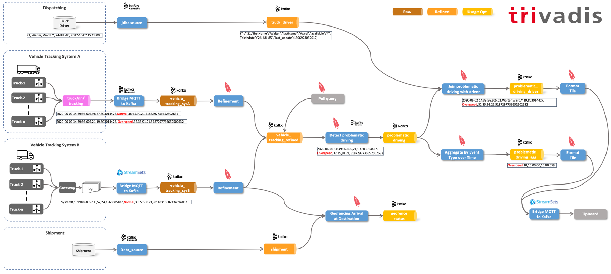

Veremos varias tecnologías en acción, como **Kafka**, **MQTT**, **Kafka Conectar**, **Arroyos de Kafka** y **ksqlDB**.

Los requisitos previos para ejecutar la plataforma son: [**Estibador**](https://www.docker.com/) y [**Docker Componer**](https://docs.docker.com/compose/) así como una instalación de [**Platys CLI**](https://github.com/TrivadisPF/platys/blob/master/documentation/install.md).

## Crear e iniciar una pila con Platys

### Generación de la pila

Primero cree una carpeta de trabajo, navegue a esta carpeta e inicialice una pila compatible con platys

```bash
mkdir tutorial-platform
cd tutorial-platform

platys init -n tutorial-platform --stack trivadis/platys-modern-data-platform --stack-version 1.16.0 --structure flat
```

Edite el `config.yml` para habilitar los siguientes servicios:

Activar `Zookeeper`

```yaml
      ZOOKEEPER_enable: true
```

Activar `Kafka`

```yaml
      KAFKA_enable: true
      KAFKA_broker_nodes: 3      
```

Activar `Kafka Connect` con 2 nodos de trabajo y algunos conectores preinstalados

```yaml
      KAFKA_CONNECT_enable: true
      KAFKA_CONNECT_nodes: 2
      KAFKA_CONNECT_connectors: confluentinc/kafka-connect-jdbc:10.0.0,confluentinc/kafka-connect-mqtt:1.3.0,debezium/debezium-connector-mysql:1.1.0
```

Activar `ksqlDB` con 2 nodos

```yaml
      KAFKA_KSQLDB_enable: true
      KAFKA_KSQLDB_edition: 'oss'
      KAFKA_KSQLDB_nodes: 2
```

Activar `kcat`, `Kafka Connect UI`, `CMAK` y `AKHQ`

```yaml
      KCAT_enable: true
      
      KAFKA_CONNECT_UI_enable: true
      
      KAFKA_CMAK_enable: true
      
      KAFKA_AKHQ_enable: true            
```

Activar `StreamSets`

```yaml
      STREAMSETS_enable: true
      STREAMSETS_stage_libs: 'streamsets-datacollector-apache-kafka_2_6-lib'      
```

Activar `MySQL` base de datos

```yaml
      MYSQL_enable: true
```

Activar `PostgreSQL` base de datos

```yaml
      POSTGRESQL_enable: true
      POSTGRESQL_volume_map_data: false
      POSTGRESQL_database: postgres
      POSTGRESQL_multiple_databases: 'demodb'
      POSTGRESQL_multiple_users: 'demo'
      POSTGRESQL_multiple_passwords: 'abc123!'
```

Activar `Adminer` y `CloudBeaver` para la gestión de bases de datos

```yaml
      ADMINER_enable: true
      CLOUDBEAVER_enable: true      
```

Activar `Mosquitto` MQTT broker y `MQTT UI`

```yaml
    MOSQUITTO_enable: true

    MQTT_UI_enable: true
```

Guarde el archivo y genere la pila.

```yaml
platys gen
```

### Inicialización del esquema de base de datos

Crear un nuevo archivo `driver.sql` en la carpeta `init/postgresql/` y agregue el siguiente contenido para crear el `logistics_db` esquema con el `driver` mesa.

```sql
\connect demodb demo

CREATE SCHEMA IF NOT EXISTS logistics_db;

SET search_path TO logistics_db;

DROP TABLE IF EXISTS driver;

CREATE TABLE driver (id BIGINT, first_name CHARACTER VARYING(45), last_name CHARACTER VARYING(45), available CHARACTER VARYING(1), birthdate DATE, last_update TIMESTAMP);

ALTER TABLE driver ADD CONSTRAINT driver_pk PRIMARY KEY (id);

INSERT INTO "driver" ("id", "first_name", "last_name", "available", "birthdate", "last_update") VALUES (10,'Diann', 'Butler', 'Y', '10-JUN-68', CURRENT_TIMESTAMP);
INSERT INTO "driver" ("id", "first_name", "last_name", "available", "birthdate", "last_update") VALUES (11,'Micky', 'Isaacson', 'Y', '31-AUG-72' ,CURRENT_TIMESTAMP);
INSERT INTO "driver" ("id", "first_name", "last_name", "available", "birthdate", "last_update") VALUES (12,'Laurence', 'Lindsey', 'Y', '19-MAY-78' ,CURRENT_TIMESTAMP);
INSERT INTO "driver" ("id", "first_name", "last_name", "available", "birthdate", "last_update") VALUES (13,'Pam', 'Harrington', 'Y','10-JUN-68' ,CURRENT_TIMESTAMP);
INSERT INTO "driver" ("id", "first_name", "last_name", "available", "birthdate", "last_update") VALUES (14,'Brooke', 'Ferguson', 'Y','10-DEC-66' ,CURRENT_TIMESTAMP);
INSERT INTO "driver" ("id", "first_name", "last_name", "available", "birthdate", "last_update") VALUES (15,'Clint','Hudson', 'Y','5-JUN-75' ,CURRENT_TIMESTAMP);
INSERT INTO "driver" ("id", "first_name", "last_name", "available", "birthdate", "last_update") VALUES (16,'Ben','Simpson', 'Y','11-SEP-74' ,CURRENT_TIMESTAMP);
INSERT INTO "driver" ("id", "first_name", "last_name", "available", "birthdate", "last_update") VALUES (17,'Frank','Bishop', 'Y','3-OCT-60' ,CURRENT_TIMESTAMP);
INSERT INTO "driver" ("id", "first_name", "last_name", "available", "birthdate", "last_update") VALUES (18,'Trevor','Hines', 'Y','23-FEB-78' ,CURRENT_TIMESTAMP);
INSERT INTO "driver" ("id", "first_name", "last_name", "available", "birthdate", "last_update") VALUES (19,'Christy','Stephens', 'Y','11-JAN-73' ,CURRENT_TIMESTAMP);
INSERT INTO "driver" ("id", "first_name", "last_name", "available", "birthdate", "last_update") VALUES (20,'Clarence','Lamb', 'Y','15-NOV-77' ,CURRENT_TIMESTAMP);

INSERT INTO "driver" ("id", "first_name", "last_name", "available", "birthdate", "last_update") VALUES (21,'Lila', 'Page', 'Y', '5-APR-77', CURRENT_TIMESTAMP);
INSERT INTO "driver" ("id", "first_name", "last_name", "available", "birthdate", "last_update") VALUES (22,'Patricia', 'Coleman', 'Y', '11-AUG-80' ,CURRENT_TIMESTAMP);
INSERT INTO "driver" ("id", "first_name", "last_name", "available", "birthdate", "last_update") VALUES (23,'Jeremy', 'Olson', 'Y', '13-JUN-82', CURRENT_TIMESTAMP);
INSERT INTO "driver" ("id", "first_name", "last_name", "available", "birthdate", "last_update") VALUES (24,'Walter', 'Ward', 'Y', '24-JUL-85', CURRENT_TIMESTAMP);
INSERT INTO "driver" ("id", "first_name", "last_name", "available", "birthdate", "last_update") VALUES (25,'Kristen', ' Patterson', 'Y', '14-JUN-73', CURRENT_TIMESTAMP);
INSERT INTO "driver" ("id", "first_name", "last_name", "available", "birthdate", "last_update") VALUES (26,'Jacquelyn', 'Fletcher', 'Y', '24-AUG-85', CURRENT_TIMESTAMP);
INSERT INTO "driver" ("id", "first_name", "last_name", "available", "birthdate", "last_update") VALUES (27,'Walter', '  Leonard', 'Y', '12-SEP-88', CURRENT_TIMESTAMP);
INSERT INTO "driver" ("id", "first_name", "last_name", "available", "birthdate", "last_update") VALUES (28,'Della', ' Mcdonald', 'Y', '24-JUL-79', CURRENT_TIMESTAMP);
INSERT INTO "driver" ("id", "first_name", "last_name", "available", "birthdate", "last_update") VALUES (29,'Leah', 'Sutton', 'Y', '12-JUL-75', CURRENT_TIMESTAMP);
INSERT INTO "driver" ("id", "first_name", "last_name", "available", "birthdate", "last_update") VALUES (30,'Larry', 'Jensen', 'Y', '14-AUG-83', CURRENT_TIMESTAMP);
INSERT INTO "driver" ("id", "first_name", "last_name", "available", "birthdate", "last_update") VALUES (31,'Rosemarie', 'Ruiz', 'Y', '22-SEP-80', CURRENT_TIMESTAMP);
INSERT INTO "driver" ("id", "first_name", "last_name", "available", "birthdate", "last_update") VALUES (32,'Shaun', ' Marshall', 'Y', '22-JAN-85', CURRENT_TIMESTAMP);
```

### Inicio de la pila

En primer lugar, asegúrese de haber establecido las dos variables de entorno siguientes, que exportan la dirección IP pública (si es un entorno de nube) y la dirección IP de Docker Engine (Docker Host):

```bash
export DOCKER_HOST_IP=<docker-host-ip>
export PUBLIC_IP=<public-host-ip>
```

Puede agregarlos a `/etc/environment` (sin exportación) para hacerlos persistentes o utilizar un `.env` dentro del archivo `docker` con las dos variables.

Es muy importante que estos dos estén configurados, de lo contrario la plataforma no funcionará correctamente.

Ahora inicie la pila usando `docker-compose`.

```bash
docker-compose up -d
```

Para mostrar todos los registros de todos los contenedores, use

```bash
docker-compose logs -f
```

Como paso final, agregue `dataplatform` como alias de la `/etc/hosts` para que los vínculos utilizados en este documento funcionen.

    <public-host-ip>		dataplatform

Para obtener una lista de los servicios disponibles, vaya a <http://dataplatform:80/services>.

Cuando se necesita un terminal, puede utilizar el terminal web disponible en <http://dataplatform:3001/>.

## Paso 0 - Inicialización

### Creación de los temas de Kafka necesarios

El clúster de Kafka está configurado con `auto.topic.create.enable` establecer en `false`. Por lo tanto, primero tenemos que crear todos los temas necesarios, utilizando el `kafka-topics` utilidad de línea de comandos de Apache Kafka.

Desde una ventana de terminal, utilice el botón `kafka-topics` CLI dentro de la `kafka-1` contenedor de Docker para crear los temas `vehicle_tracking_` y ` logisticsdb_driver  `.

```bash
docker exec -it kafka-1 kafka-topics --bootstrap-server kafka-1:19092 --create --topic vehicle_tracking_sysA --partitions 8 --replication-factor 3
docker exec -it kafka-1 kafka-topics --bootstrap-server kafka-1:19092  --create --topic vehicle_tracking_sysB --partitions 8 --replication-factor 3
```

Si no te gusta trabajar con la CLI, también puedes crear los temas de Kafka utilizando las interfaces gráficas de usuario [Administrador de clústeres para Kafka (CMAK)](http://dataplatform:28104) o el [Apache Kafka HQ (AKHQ)](http://dataplatform:28107).

### Compruebe logistics_db base de datos Postgresql

Las tablas necesarias se crean automáticamente al ejecutar la pila mediante Docker Compose. Utilice el siguiente comando en una ventana de terminal para mostrar el contenido de la `driver` mesa:

```bash
docker exec -ti postgresql psql -d demodb -U demo -c "SELECT * FROM logistics_db.driver"
```

### Configurar la base de datos MySQL de envío

Cree la tabla MySQL con información de envío:

```bash
docker exec -it mysql bash -c 'mysql -u root -pmanager'
```

```sql
CREATE USER 'debezium'@'%' IDENTIFIED WITH mysql_native_password BY 'dbz';
CREATE USER 'replicator'@'%' IDENTIFIED BY 'replpass';
GRANT SELECT, RELOAD, SHOW DATABASES, REPLICATION SLAVE, REPLICATION CLIENT  ON *.* TO 'debezium';
GRANT REPLICATION SLAVE, REPLICATION CLIENT ON *.* TO 'replicator';

GRANT SELECT, INSERT, UPDATE, DELETE ON sample.* TO sample;

USE sample;

DROP TABLE shipment;

CREATE TABLE shipment (
                id INT PRIMARY KEY,
                vehicle_id INT,
                target_wkt VARCHAR(2000),
                create_ts timestamp DEFAULT CURRENT_TIMESTAMP,
                update_ts timestamp DEFAULT CURRENT_TIMESTAMP ON UPDATE CURRENT_TIMESTAMP
);
                
INSERT INTO shipment (id, vehicle_id, target_wkt)  VALUES (1,11, 'POLYGON ((-91.29638671875 39.04478604850143, -91.4501953125 38.46219172306828, -90.98876953125 37.94419750075404, -89.912109375 37.78808138412046, -88.9892578125 38.37611542403604, -88.92333984375 38.77121637244273, -89.71435546875 39.470125122358176, -90.19775390625 39.825413103424786, -91.29638671875 39.04478604850143))');     

INSERT INTO shipment (id, vehicle_id, target_wkt)  VALUES (2, 42, 'POLYGON ((-91.29638671875 39.04478604850143, -91.4501953125 38.46219172306828, -90.98876953125 37.94419750075404, -89.912109375 37.78808138412046, -88.9892578125 38.37611542403604, -88.92333984375 38.77121637244273, -89.71435546875 39.470125122358176, -90.19775390625 39.825413103424786, -91.29638671875 39.04478604850143))');         

INSERT INTO shipment (id, vehicle_id, target_wkt)  VALUES (3, 12, 'POLYGON ((-91.29638671875 39.04478604850143, -91.4501953125 38.46219172306828, -90.98876953125 37.94419750075404, -89.912109375 37.78808138412046, -88.9892578125 38.37611542403604, -88.92333984375 38.77121637244273, -89.71435546875 39.470125122358176, -90.19775390625 39.825413103424786, -91.29638671875 39.04478604850143))'); 
                
INSERT INTO shipment (id, vehicle_id, target_wkt)  VALUES (4, 13, 'POLYGON ((-91.29638671875 39.04478604850143, -91.4501953125 38.46219172306828, -90.98876953125 37.94419750075404, -89.912109375 37.78808138412046, -88.9892578125 38.37611542403604, -88.92333984375 38.77121637244273, -89.71435546875 39.470125122358176, -90.19775390625 39.825413103424786, -91.29638671875 39.04478604850143))'); 

INSERT INTO shipment (id, vehicle_id, target_wkt)  VALUES (5, 14, 'POLYGON ((-91.29638671875 39.04478604850143, -91.4501953125 38.46219172306828, -90.98876953125 37.94419750075404, -89.912109375 37.78808138412046, -88.9892578125 38.37611542403604, -88.92333984375 38.77121637244273, -89.71435546875 39.470125122358176, -90.19775390625 39.825413103424786, -91.29638671875 39.04478604850143))'); 

INSERT INTO shipment (id, vehicle_id, target_wkt)  VALUES (6, 15, 'POLYGON ((-91.29638671875 39.04478604850143, -91.4501953125 38.46219172306828, -90.98876953125 37.94419750075404, -89.912109375 37.78808138412046, -88.9892578125 38.37611542403604, -88.92333984375 38.77121637244273, -89.71435546875 39.470125122358176, -90.19775390625 39.825413103424786, -91.29638671875 39.04478604850143))'); 

INSERT INTO shipment (id, vehicle_id, target_wkt)  VALUES (7, 32, 'POLYGON ((-91.29638671875 39.04478604850143, -91.4501953125 38.46219172306828, -90.98876953125 37.94419750075404, -89.912109375 37.78808138412046, -88.9892578125 38.37611542403604, -88.92333984375 38.77121637244273, -89.71435546875 39.470125122358176, -90.19775390625 39.825413103424786, -91.29638671875 39.04478604850143))'); 

INSERT INTO shipment (id, vehicle_id, target_wkt)  VALUES (8, 48, 'POLYGON ((-91.29638671875 39.04478604850143, -91.4501953125 38.46219172306828, -90.98876953125 37.94419750075404, -89.912109375 37.78808138412046, -88.9892578125 38.37611542403604, -88.92333984375 38.77121637244273, -89.71435546875 39.470125122358176, -90.19775390625 39.825413103424786, -91.29638671875 39.04478604850143))'); 
```

### Simulación de datos de seguimiento de vehículos

Para simular los datos de seguimiento de vehículos, vamos a utilizar un programa Java (adaptado de Hortonworks) y mantenido [aquí](https://github.com/TrivadisBDS/various-bigdata-prototypes/tree/master/streaming-sources/iot-truck-simulator/impl).

El simulador puede producir datos para varios objetivos, como **Kafka**, **MQTT** o **Archivos**. Estas dos opciones se muestran a continuación.

Ahora vamos a producir los eventos de camiones para el corredor MQTT que se ejecuta en el puerto 1883. En una ventana de terminal ejecute el siguiente comando:

```bash
docker run --network tutorial-platform --rm trivadis/iot-truck-simulator '-s' 'MQTT' '-h' 'mosquitto-1' '-p' '1883' '-f' 'JSON' '-vf' '1-49'
```

Deje esto en ejecución en la ventana del terminal.

***

**Nota:** Puede acceder a este taller aquí omitiendo el paso 1 y publicando directamente en Kafka en lugar de MQTT. En ese caso, saltar a [Paso 2](https://github.com/gschmutz/event-driven-microservices-workshop/tree/main/09-vehicle-tracking-application#step-2---using-ksql-to-refine-the-data) y utilice el siguiente comando en lugar del anterior `docker run trivadis/iot-truck-simulator '-s' 'KAFKA' '-h' $DOCKER_HOST_IP '-p' '9092' '-f' 'JSON' '-vf' '1-49' '-topics' 'vehicle_tracking_sysA'` después de haber creado el tema kafka necesario.

***

## Paso 1 - Consumir mensajes de seguimiento de vehículos de MQTT y enviarlos a Kafka

En esta parte mostraremos cómo podemos consumir los datos del broker MQTT y enviarlos a un tema de Kafka. Usaremos *Kafka Conectar* para eso.

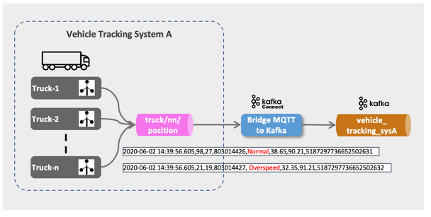

### Comprobar mensaje en MQTT

Veamos primero que recibimos mensajes de seguimiento de vehículos en el tema Jerarquía de temas MQTT `trucks/+/position`.

Hay dos opciones para consumir desde MQTT

*   Utilizar el cliente MQTT dockerizado en el terminal
*   usar la interfaz de usuario web de HiveMQ basada en explorador

#### Uso del cliente MQTT dockerizado

Para comenzar a consumir a través de una línea de comandos, realice el siguiente comando docker:

```bash
docker run --network tutorial-platform -it --rm efrecon/mqtt-client sub -h mosquitto-1 -t "truck/+/position" -v
```

Los mensajes consumidos aparecerán en el terminal.

#### Uso de la interfaz de usuario web de HiveMQ

Para empezar a consumir con la interfaz de usuario MQTT ([Interfaz de usuario web de HiveMQ](https://www.hivemq.com/docs/3.4/web-ui/introduction.html)), vaya a <http://dataplatform:28136> y conéctese usando `dataplatform` para el **Anfitrión** campo `9101` para el **Puerto** y luego haga clic en **Conectar**:

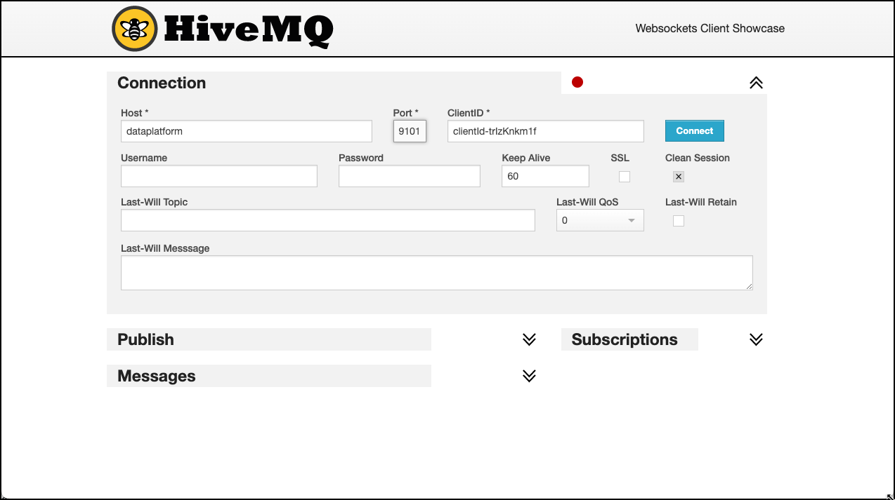

Cuando se conecte correctamente, haga clic en Agregar nueva suscripción a un tema e ingrese `truck/+/position` en **Tema** y haga clic en **Subscribir**:

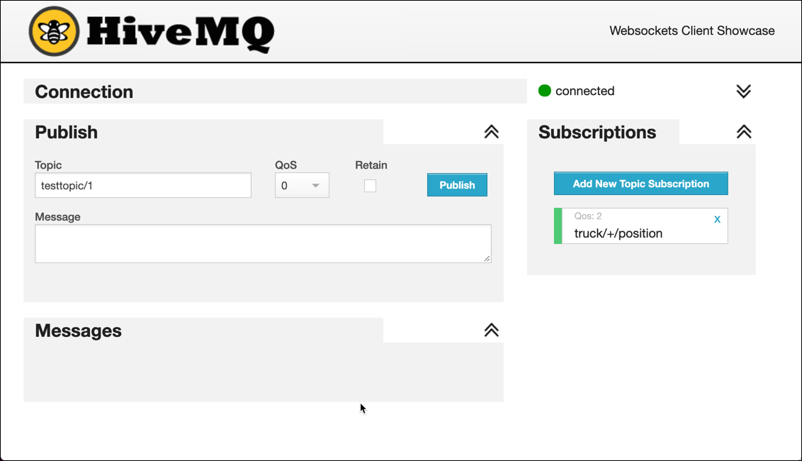

Tan pronto como se produzcan mensajes en MQTT, debería verlos en la CLI o en la interfaz de usuario de MQTT (Hive MQ) como se muestra a continuación.

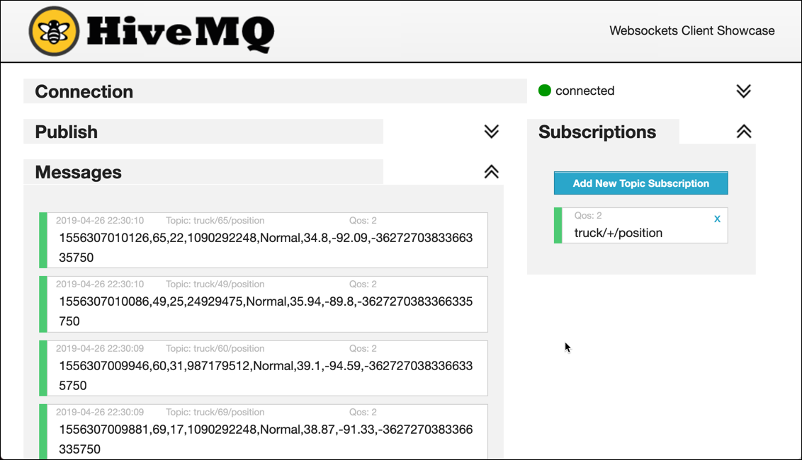

Alternativamente, también puede utilizar el [MQTT.fx](https://mqttfx.jensd.de/), [Explorador MQTT](https://mqtt-explorer.com/) o [MQTTLens](https://chrome.google.com/webstore/detail/mqttlens/hemojaaeigabkbcookmlgmdigohjobjm?hl=de) aplicaciones para buscar los mensajes en el agente MQTT. Todos están disponibles para su instalación en Mac o Windows.

### Configurar Kafka Connect para establecer un puente entre MQTT y Kafka

Para llevar los mensajes de MQTT a Kafka, utilizaremos el marco Kafka Connect. Kafka Connect es parte del proyecto Apache Kafka y puede ejecutar varios conectores, ya sea como Source o como Sink Connector, como se muestra en el siguiente diagrama:

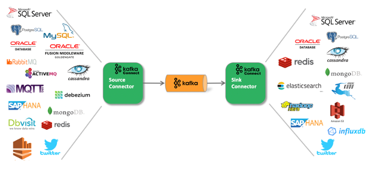

Los conectores están disponibles en Confluent, así como en otras organizaciones de la 3ª parte. Una buena fuente de conectores es el [Hub confluente](https://www.confluent.io/hub/), aunque no está completo, algunos conectores también se pueden encontrar en proyectos de GitHub.

Hay varios conectores Kafka disponibles para MQTT. Podemos usar el proporcionado por [Confluente Inc.](https://www.confluent.io/connector/kafka-connect-mqtt/) (en versión preliminar y disponible como licencia de evaluación en Confluent Hub) o la proporcionada como parte del [Proyecto Landoop Stream-Reactor](https://github.com/Landoop/stream-reactor/tree/master/kafka-connect-mqtt) disponible en GitHub. Aquí utilizaremos el proporcionado por Confluent. Solo tenga en cuenta que es parte de Confluent Enterprise, pero está disponible para su evaluación.

El conector MQTT confluente se descargó al ejecutar la pila Compose. Puede comprobar que el conector está instalado llamando a la API REST del clúster de Kafka Connector:

```bash
curl -XGET http://$DOCKER_HOST_IP:8083/connector-plugins | jq
```

Antes de iniciar el conector, usemos un oyente de consola de Kafka para consumir desde el tema de destino `vehicle_tracking_sysA`. Podemos utilizar el [`kcat`](https://github.com/edenhill/kcat) utilidad (anteriormente kcat`kcat`), que puede instalar localmente o utilizar el proporcionado con la pila Compose:

```bash
docker exec -ti kcat kcat -b kafka-1 -t vehicle_tracking_sysA -f "%k - %s\n"
```

Ahora comencemos el conector:

```bash
curl -X "POST" "$DOCKER_HOST_IP:8083/connectors" \
     -H "Content-Type: application/json" \
     --data '{
  "name": "mqtt-vehicle-position-source",
  "config": {
    "connector.class": "io.confluent.connect.mqtt.MqttSourceConnector",
    "tasks.max": "1",
    "mqtt.server.uri": "tcp://mosquitto-1:1883",
    "mqtt.topics": "truck/+/position",
    "mqtt.clean.session.enabled":"true",
    "mqtt.connect.timeout.seconds":"30",
    "mqtt.keepalive.interval.seconds":"60",
    "mqtt.qos":"0",
    "kafka.topic":"vehicle_tracking_sysA",
    "confluent.topic.bootstrap.servers": "kafka-1:19092,kafka-2:19093",
    "confluent.topic.replication.factor": "3",
    "key.converter": "org.apache.kafka.connect.storage.StringConverter",
    "value.converter": "org.apache.kafka.connect.converters.ByteArrayConverter"
    }
  }'
```

Los mensajes de posición del camión se envían al `vehicle_tracking_sysA` y debe aparecer en el consumidor de kcat inmediatamente.

Si desea detener el conector, puede volver a utilizar la API de REST:

```bash
curl -X "DELETE" "$DOCKER_HOST_IP:8083/connectors/mqtt-vehicle-position-source"
```

### Conector de monitor en la interfaz de usuario de Kafka Connect

Desplácese hasta el icono [Interfaz de usuario de Kafka Connect](http://dataplatform:28103) para ver el conector en una ventana gráfica.

## Paso 2 - Uso de KSQL para refinar los datos

En esta parte refinaremos los datos y los colocaremos en un nuevo tema. La idea aquí es tener un tema normalizado en formato Avro, donde se colocarán todos los datos de seguimiento tanto del sistema A como del B, para que el procesamiento posterior pueda llevarlo desde allí. Para el refinamiento usaremos ksqlDB.

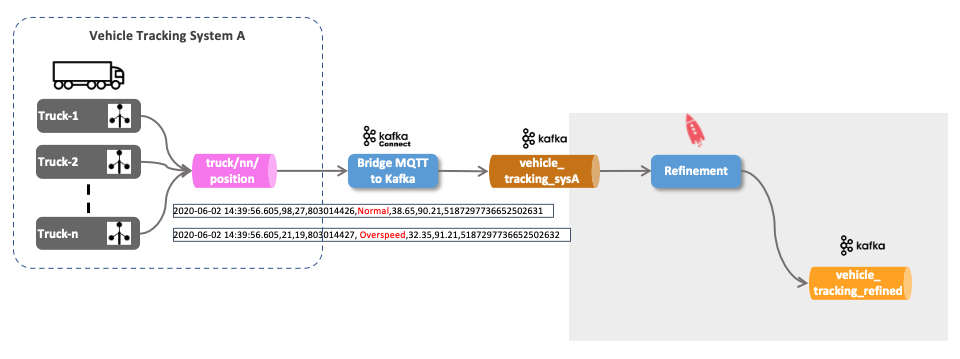

### ¿Qué es ksqlDB?

ksqlDB es una base de datos de transmisión de eventos diseñada específicamente para ayudar a los desarrolladores a crear aplicaciones de procesamiento de flujos sobre Apache Kafka.


[*Fuente: Confluente*](https://docs.ksqldb.io/en/latest/)

### Conectarse al motor ksqlDB

Conectémonos al shell de ksqlDB

```bash
docker exec -it ksqldb-cli ksql http://ksqldb-server-1:8088
```

### Usar ksqlDB para mostrar mensajes

Mostrar los temas de Kafka disponibles

```sql
show topics;
```

Consumamos los datos de la `vehicle_tracking_sysA` , suponiendo que el simulador de camión y el conector MQTT todavía se están ejecutando.

```sql
print 'vehicle_tracking_sysA';
```

También puede agregar la palabra clave `from beginning` para empezar a consumir al principio del tema.

```sql
print 'vehicle_tracking_sysA' from beginning;
```

También puede usar los comandos show para mostrar los otros objetos KSQL (que ahora crearemos)

```sql
show streams;
show tables;
show queries;
```

### Crear una secuencia y SELECCIONAR a partir de ella

Primero suelte la secuencia si ya existe:

```sql
DROP STREAM IF EXISTS vehicle_tracking_sysA_s;
```

Ahora vamos a crear el ksqlDB Stream

```sql
CREATE STREAM IF NOT EXISTS vehicle_tracking_sysA_s 
  (mqttTopic VARCHAR KEY,
  timestamp VARCHAR, 
   truckId VARCHAR, 
   driverId BIGINT, 
   routeId BIGINT,
   eventType VARCHAR,
   latitude DOUBLE,
   longitude DOUBLE,
   correlationId VARCHAR)
  WITH (kafka_topic='vehicle_tracking_sysA',
        value_format='JSON');
```

Estamos utilizando el `JSON` formato de valor, ya que nuestra secuencia es una cadena con formato JSON.

Veamos los datos en vivo usando un `SELECT` en la transmisión con el botón `EMIT CHANGES` cláusula:

```sql
SELECT * FROM vehicle_tracking_sysA_s EMIT CHANGES;
```

Esto es lo que se llama *Consulta push* (declarado por el `EMIT CHANGES` cláusula). Una consulta push es una forma de consulta emitida por un cliente que se suscribe a un resultado a medida que cambia en tiempo real.


[*Fuente: Confluente*](https://docs.ksqldb.io/en/latest/concepts/queries/push/)

Debería ver un flujo continuo de eventos como resultado de la instrucción SELECT, similar como se muestra a continuación:

    ksql> SELECT * from vehicle_tracking_sysA_s EMIT CHANGES;
    +------------------------------+------------------------------+------------------------------+------------------------------+------------------------------+------------------------------+------------------------------+------------------------------+------------------------------+
    |MQTTTOPIC                     |TIMESTAMP                     |TRUCKID                       |DRIVERID                      |ROUTEID                       |EVENTTYPE                     |LATITUDE                      |LONGITUDE                     |CORRELATIONID                 |
    +------------------------------+------------------------------+------------------------------+------------------------------+------------------------------+------------------------------+------------------------------+------------------------------+------------------------------+
    |truck/11/position             |1599398981285                 |11                            |17                            |1594289134                    |Normal                        |38.99                         |-93.45                        |-8240058917944842967          |
    |truck/42/position             |1599398981846                 |42                            |22                            |1325562373                    |Normal                        |37.15                         |-97.32                        |-8240058917944842967          |
    |truck/10/position             |1599398982135                 |10                            |10                            |1962261785                    |Normal                        |38.09                         |-91.44                        |-8240058917944842967          |
    |truck/34/position             |1599398982454                 |34                            |16                            |1198242881                    |Normal                        |39.01                         |-93.85                        |-8240058917944842967          |

Hemos enviado nuestra primera declaración KSQL simple. Agreguemos ahora algunos análisis a esta declaración base.

Obtén información sobre la transmisión mediante el botón `DESCRIBE` mandar

```sql
DESCRIBE vehicle_tracking_sysA_s;
DESCRIBE EXTENDED vehicle_tracking_sysA_s;
```

### Cree un nuevo flujo "refinado" donde los datos se transformen en Avro

Primero suelte la secuencia si ya existe:

```sql
DROP STREAM IF EXISTS vehicle_tracking_refined_s;
```

Y ahora cree el refinado ksqlDB Stream con un `CREATE STREAM ... AS SELECT ...` declaración. Incluimos una columna adicional `source`, que contiene el sistema del que provienen los datos.

```sql
CREATE STREAM IF NOT EXISTS vehicle_tracking_refined_s 
  WITH (kafka_topic='vehicle_tracking_refined',
        value_format='AVRO',
        VALUE_AVRO_SCHEMA_FULL_NAME='com.trivadis.avro.VehicleTrackingRefined')
AS SELECT truckId AS ROWKEY
		, 'Tracking_SysA' AS source
		, timestamp
		, AS_VALUE(truckId) AS vehicleId
		, driverId
		, routeId
		, eventType
		, latitude
		, longitude
		, correlationId
FROM vehicle_tracking_sysA_s
PARTITION BY truckId
EMIT CHANGES;
```

Para verificar que el tema refinado de hecho contenga datos con formato Avro, hagamos un kcat normal en el `vehicle_tracking_refined` tema

```bash
docker exec -ti kcat kcat -b kafka-1 -t vehicle_tracking_refined
```

podemos ver que está serializado como Avro

                                Normal���Q�B@ףp=
    WX�$343671958179690963
    1598125263176886����
                                 Normal��Q��C@�p=
    דW�$343671958179690963
    % Reached end of topic vehicle_tracking_refined [0] at offset 367
    159812526333671�ߩ�2Unsafe following distance�Q���B@���(\?W�$343671958179690963
    % Reached end of topic vehicle_tracking_refined [5] at offset 353
    % Reached end of topic vehicle_tracking_refined [2] at offset 324
    1598125263526101����
                                  Normal=
    ףpE@R����V�$343671958179690963
    % Reached end of topic vehicle_tracking_refined [7] at offset 355

podemos utilizar el `-s` y `-r` para especificar el Avro Serde y la dirección URL del registro de esquema y el resultado es legible:

```bash
docker exec -ti kcat kcat -b kafka-1 -t vehicle_tracking_refined -s value=avro -r http://schema-registry-1:8081
```

Puede usar la interfaz de usuario del Registro de esquemas en <http://dataplatform:28102> para ver el esquema avro creado por ksqlDB.

## Paso 3 - Integrar el sistema B

En esta parte mostraremos cómo podemos integrar los datos del 2º sistema de seguimiento de vehículos (Sistema B), donde el único punto de integración disponible es un conjunto de archivos de registro. Podemos seguir estos archivos de registro y por eso obtener la información tan pronto como llegue. Convertimos la fuente del archivo en una fuente de datos de transmisión por eso. Usaremos [Recopilador de datos StreamSets](https://streamsets.com/products/dataops-platform/data-collector/) para la operación de cola, como en la vida real, este recopilador de datos tendría que ejecutarse en el propio Sistema de Seguimiento de Vehículos o al menos en una máquina al lado. Al final, debe poder acceder al archivo activo real mientras la aplicación lo está escribiendo. StreamSets incluso tiene una opción Edge que es una versión reducida de la versión completa y es capaz de ejecutarse en un Rasperry Pi.

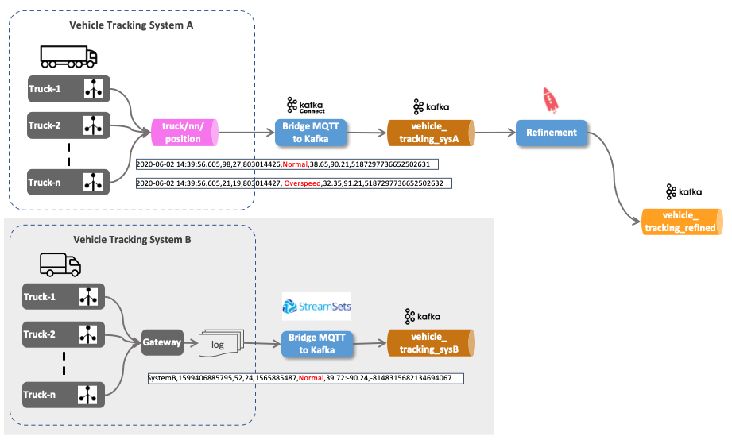

Comencemos nuevamente un simulador, pero esta vez simulando el archivo donde se agregan los datos de seguimiento a:

```bash
docker run -v "${PWD}/data-transfer/logs:/out" --rm trivadis/iot-truck-simulator "-s" "FILE" "-f" "CSV" "-d" "1000" "-vf" "50-100" "-es" "2"
```

Crear un flujo de datos de StreamSets para incluir el archivo en el tema kafka `vehicle_tracking_sysB`.

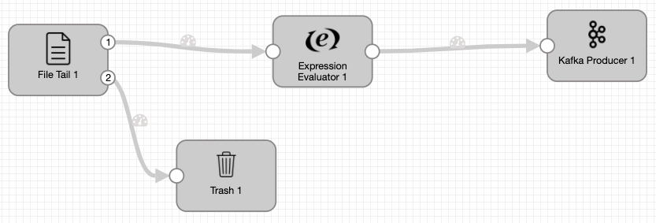

Puede importar ese flujo de datos desde `./streamsets/File_to_Kafka.json` si no quieres crearlo desde cero.

Ahora escuchemos sobre el nuevo tema

```bash
docker exec -ti kcat kcat -b kafka-1 -t vehicle_tracking_sysB -f "%k - %s\n" -q
```

y, a continuación, inicie el flujo en StreamSets. Debería ver los datos del archivo que llegan como un flujo de datos de seguimiento de vehículos.

    Field[STRING:97] - {"text":"SystemB,1599556302227,97,21,1325712174,Normal,37.7:-92.61,4331001611104251967"}
    Field[STRING:97] - {"text":"SystemB,1599556302994,97,21,1325712174,Normal,37.6:-92.74,4331001611104251967"}
    Field[STRING:97] - {"text":"SystemB,1599556303791,97,21,1325712174,Normal,37.51:-92.89,4331001611104251967"}

La primera parte (antes del guión) muestra el contenido de la clave Kafka, generada en el `Expression Evaluator` en StreamSets. La segunda parte representa el valor de Kafka. En comparación con los datos del Sistema A, este sistema entrega sus datos en formato CSV. Además, se produce el nombre del sistema y solo hay un valor para latitud/longitud, se envía como cadena y los dos valores están delimitados por un carácter de dos puntos (`:`).

## Paso 4 - Refinamiento de los datos del Sistema B en el mismo tema que el anterior

En esta parte haremos el refinamiento de los datos sin procesar del Sistema B y los colocaremos en el mismo tema. `vehicle_tracking_refined` como se utiliza en el paso 2.

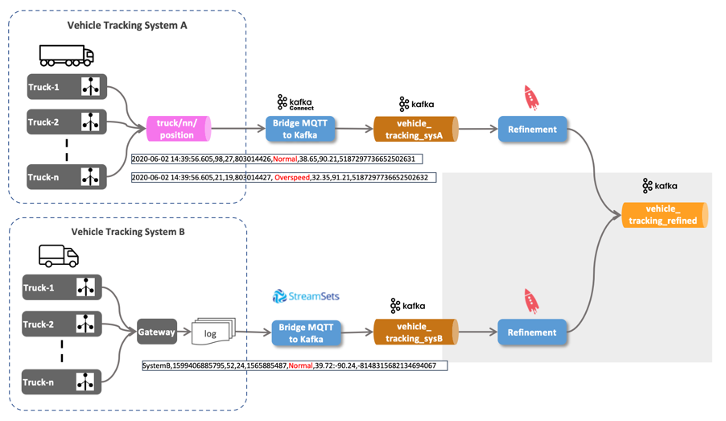

Firs permite crear el Stream en el tema de datos sin procesar:

```sql
DROP STREAM IF EXISTS vehicle_tracking_sysB_s;

CREATE STREAM IF NOT EXISTS vehicle_tracking_sysB_s 
  (ROWKEY VARCHAR KEY,
   system VARCHAR,
   timestamp VARCHAR, 
   vehicleId VARCHAR, 
   driverId BIGINT, 
   routeId BIGINT,
   eventType VARCHAR,
   latLong VARCHAR,
   correlationId VARCHAR)
  WITH (kafka_topic='vehicle_tracking_sysB',
        value_format='DELIMITED');
```

El sistema B entrega la latitud y la longitud en un campo como una cadena, con los dos valores delimitados por un carácter de dos puntos.

```sql
DESCRIBE vehicle_tracking_sysB_s;
DESCRIBE vehicle_tracking_refined_s;
```

Ahora podemos usar el `INSERT` para escribir los datos en el `vehicle_tracking_refined_s` stream que hemos creado en el paso 2. Tenemos que asegurarnos de que la estructura coincida (el refinamiento que realizamos), que en este caso está proporcionando el valor adecuado para el `soruce` columna, así como la división de la `latLong` valor en un `latitude` y `longitude` valor:

```sql
INSERT INTO vehicle_tracking_refined_s 
SELECT ROWKEY
    , 'Tracking_SysB' AS source
	, timestamp
	, vehicleId
	, driverId
	, routeId
	, eventType
	, cast(split(latLong,':')[1] as DOUBLE) as latitude
	, CAST(split(latLong,':')[2] AS DOUBLE) as longitude
	, correlationId
FROM vehicle_tracking_sysB_s
EMIT CHANGES;
```

## Paso 5 - Consulta de extracción en la información de seguimiento del vehículo ("Sombra del dispositivo")

Por lo tanto, con los datos de posición del vehículo de ambos sistemas de origen normalizados en el `vehicle_tracking_refined` y disponible en ksqlDB a través del `vehicle_tracking_refined_s` objeto stream, es posible consultar la última posición para un vehículo determinado.

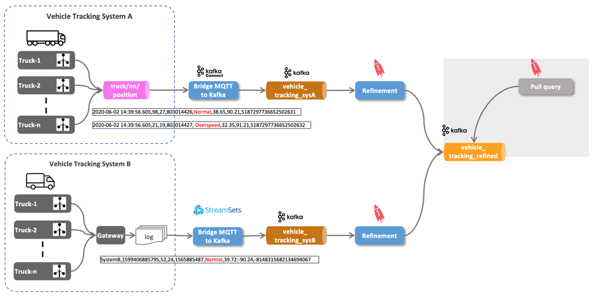

En ksqlDB se llaman consultas suche *extraer consultas*, en contraste con las consultas de streaming que hemos visto hasta ahora, conocidas como *consultas push* (utilizando el `EMIT CHANGES` cláusula). Una consulta de extracción es una forma de consulta emitida por un cliente que recupera un resultado a partir de "ahora", como una consulta contra un RDBS tradicional.


[*Fuente: Confluente*](https://docs.ksqldb.io/en/latest/concepts/queries/pull/)

Así que hagamos un `SELECT` en la secuencia, restringiendo en el `vehicleId` sin un `EMIT CHANGES`

```sql
SELECT * FROM vehicle_tracking_refined_s WHERE vehicleId = 42;
```

Obtenemos el siguiente error de ksqlDB: `Pull queries are not supported on streams.`.

Las consultas de extracción solo funcionan en vistas materializadas, que son las `Table`s y no el `Stream`s. Entonces, ¿podemos crear una tabla que entregue la información?

¡Claro! Aquí está la declaración necesaria:

```sql
DROP TABLE IF EXISTS vehicle_tracking_refined_t DELETE TOPIC;

CREATE TABLE IF NOT EXISTS vehicle_tracking_refined_t
WITH (kafka_topic = 'vehicle_tracking_refined_t')
AS
SELECT vehicleId
       , latest_by_offset(driverId)	   driverId
		, latest_by_offset(source)			source
		, latest_by_offset(eventType)		eventType
		, latest_by_offset(latitude)		latitude
		, latest_by_offset(longitude)		longitude
FROM vehicle_tracking_refined_s
GROUP BY vehicleId
EMIT CHANGES;
```

Esta tabla utiliza el vehicleId como clave principal (debido al GROUP BY) y materializa todos los valores como el último de la agregación.

```sql
DESCRIBE vehicle_tracking_refined_t;
```

Una descripción en la tabla muestra que esta clave principal es de tipo `STRING`:

    ksql> DESCRIBE vehicle_tracking_refined_t;

    Name                 : VEHICLE_TRACKING_REFINED_T
     Field     | Type
    --------------------------------------------
     VEHICLEID | VARCHAR(STRING)  (primary key)
     DRIVERID  | BIGINT
     SOURCE    | VARCHAR(STRING)
     EVENTTYPE | VARCHAR(STRING)
     LATITUDE  | DOUBLE
     LONGITUDE | DOUBLE
    --------------------------------------------

Entonces, para probar la consulta de extracción, tenemos que cambiar a una cadena, de lo contrario se muestra un error:

```sql
SELECT * FROM vehicle_tracking_refined_t WHERE vehicleId = '42';
```

Pero también podríamos cambiar el `CREATE TABLE` declaración a CAST el `vehicleId` en un `BIGINT`:

```sql
DROP TABLE IF EXISTS vehicle_tracking_refined_t DELETE TOPIC;

CREATE TABLE IF NOT EXISTS vehicle_tracking_refined_t
WITH (kafka_topic = 'vehicle_tracking_refined_t')
AS
SELECT CAST(vehicleId AS BIGINT)			vehicleId
       , latest_by_offset(driverId)	   driverId
		, latest_by_offset(source)			source
		, latest_by_offset(eventType)		eventType
		, latest_by_offset(latitude)		latitude
		, latest_by_offset(longitude)		longitude
FROM vehicle_tracking_refined_s
GROUP BY CAST(vehicleId AS BIGINT)
EMIT CHANGES;
```

Ahora podemos usarlo con un entero:

```sql
SELECT * FROM vehicle_tracking_refined_t WHERE vehicleId = 42;
```

## Paso 6 - Investigar el comportamiento de conducción

En esta parte utilizaremos ksqlDB y como solución alternativa Kafka Streams o Faust para analizar los datos en el tema refinado `vehicle_tracking_refined`.

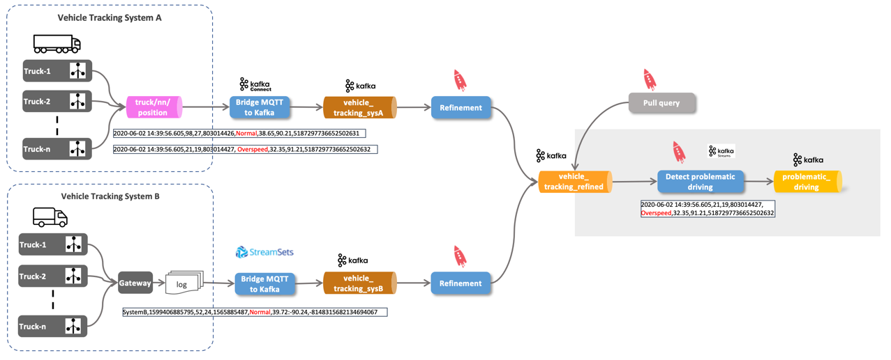

Ahora con los datos de ambos sistemas integrados, ¡trabajemos con ellos!

En este nuevo stream solo nos interesan los mensajes donde el `eventType` no es normal. Primero vamos a crear una instrucción SELECT que realice el resultado correcto, utilizando la CLI de ksqlDB:

```sql
SELECT * FROM vehicle_tracking_refined_s 
WHERE eventType != 'Normal'
EMIT CHANGES;
```

Ahora vamos a crear una nueva corriente con esa información.

```sql
DROP STREAM IF EXISTS problematic_driving_s;

CREATE STREAM IF NOT EXISTS problematic_driving_s
  WITH (kafka_topic='problematic_driving',
        value_format='AVRO',
        partitions=8)
AS 
SELECT * 
FROM vehicle_tracking_refined_s
WHERE eventtype != 'Normal';
```

Podemos ver que la transmisión ahora solo contiene los mensajes filtrados a los relevantes:

```sql
SELECT * FROM problematic_driving_s
EMIT CHANGES;
```

También podemos ver la misma información obteniendo directamente los datos del tema kafka subyacente. `problematic_driving`:

```bash
docker exec -ti kcat kcat -b kafka-1 -t problematic_driving -s value=avro -r http://schema-registry-1:8081
```

### Alternativa usando Kafka Streams

La misma lógica también se puede implementar utilizando Kafka Streams. En la carpeta `java` encontrarás el proyecto Kafka Streams `kafka-streams-vehicle-tracking` con la implementación. El valor que consumimos de la `vehicle_tracking_refined` el tema se serializa como Avro. Por lo tanto, configuramos Kafka Streams para usar el `SpecificAvroSerde`.

```java
package com.trivadis.kafkastreams;

import com.trivadis.avro.VehicleTrackingRefined;
import io.confluent.kafka.serializers.AbstractKafkaAvroSerDeConfig;
import io.confluent.kafka.streams.serdes.avro.SpecificAvroSerde;
import org.apache.commons.cli.*;
import org.apache.kafka.clients.consumer.ConsumerConfig;
import org.apache.kafka.common.serialization.Serdes;
import org.apache.kafka.streams.KafkaStreams;
import org.apache.kafka.streams.StreamsBuilder;
import org.apache.kafka.streams.StreamsConfig;
import org.apache.kafka.streams.kstream.KStream;

import java.util.Properties;

public class DetectProblematicDriving {

	static final String VEHICLE_TRACKING_REFINED_STREAM = "vehicle_tracking_refined";
	static final String PROBLEMATIC_DRIVING_STREAM = "problematic_driving-kstreams";

	public static void main(final String[] args) {
		final String applicationId = "test";
		final String clientId = "test";
		final String bootstrapServer = "dataplatform:9092";
		final String schemaRegistryUrl = "http://dataplatform:8081";
		final boolean cleanup = false;
		final String stateDirPath = "C:\\tmp\\kafka-streams";

		final KafkaStreams streams = buildFeed(applicationId, clientId, bootstrapServer, schemaRegistryUrl, stateDirPath);

		if (cleanup) {
			streams.cleanUp();
		}
		streams.start();

		// Add shutdown hook to respond to SIGTERM and gracefully close Kafka Streams
		Runtime.getRuntime().addShutdownHook(new Thread(new Runnable() {
			@Override
			public void run() {
				streams.close();
			}
		}));
	}

	private static KafkaStreams buildFeed(final String applicationId, final String clientId, final String bootstrapServers, final String schemaRegistryUrl,
										  final String stateDir) {

		final Properties streamsConfiguration = new Properties();

		// Give the Streams application a unique name. The name must be unique in the
		// Kafka cluster
		// against which the application is run.
		streamsConfiguration.put(StreamsConfig.APPLICATION_ID_CONFIG, applicationId);
		streamsConfiguration.put(StreamsConfig.CLIENT_ID_CONFIG, clientId);

		// Where to find Kafka broker(s).
		streamsConfiguration.put(StreamsConfig.BOOTSTRAP_SERVERS_CONFIG, bootstrapServers);

		// Where to find the Confluent schema registry instance(s)
		streamsConfiguration.put(AbstractKafkaAvroSerDeConfig.SCHEMA_REGISTRY_URL_CONFIG, schemaRegistryUrl);

		// Specify default (de)serializers for record keys and for record values.
		streamsConfiguration.put(StreamsConfig.DEFAULT_KEY_SERDE_CLASS_CONFIG, Serdes.String().getClass().getName());
		streamsConfiguration.put(StreamsConfig.DEFAULT_VALUE_SERDE_CLASS_CONFIG, SpecificAvroSerde.class);
		streamsConfiguration.put(StreamsConfig.STATE_DIR_CONFIG, stateDir);
		streamsConfiguration.put(ConsumerConfig.AUTO_OFFSET_RESET_CONFIG, "earliest");

		// Records should be flushed every 10 seconds. This is less than the default
		// in order to keep this example interactive.
		streamsConfiguration.put(StreamsConfig.COMMIT_INTERVAL_MS_CONFIG, 10 * 1000);

		// If Confluent monitoring interceptors are on the classpath,
		// then the producer and consumer interceptors are added to the
		// streams application.
		// MonitoringInterceptorUtils.maybeConfigureInterceptorsStreams(streamsConfiguration);


		final StreamsBuilder builder = new StreamsBuilder();

		// read the source stream (keyed by objectId)
		final KStream<String, VehicleTrackingRefined> vehicleTracking = builder.stream(VEHICLE_TRACKING_REFINED_STREAM);

		vehicleTracking.peek((k,v) -> System.out.println("vehicleTracking.peek(...) : " + k + " : " + v));

		// filter out all events where eventType equals "Normal"
		final KStream<String, VehicleTrackingRefined> vehicleTrackingFiltered = vehicleTracking.filterNot((k,v) -> "Normal".equals (v.getEVENTTYPE().toString()));

		// Send the Matches to the Kafka Topic
		vehicleTrackingFiltered.to(PROBLEMATIC_DRIVING_STREAM);

		// read the driver
		//final KTable<String, Driver> driver = builder.table(DRIVER_STREAM);

		// Left Join Positions Mecomo Raw with Barge to get the barge id
		//KStream<String, PositionMecomo> positionsMecomo  =  positionsMecomoRaw.leftJoin(barge,
		//		(leftValue, rightValue) -> createFrom(leftValue, (rightValue != null ? rightValue.getId() : -1) ),
		//		Joined.<String, PositionMecomoRaw, Barge>keySerde(Serdes.String())
		//);

		return new KafkaStreams(builder.build(), streamsConfiguration);
	}
}
```

Para no dar ningún conflicto con la versión ksqlDB, la implementación de Kafka Streams publica en su propio tema `problematic_driving-kstreams`. Así que vamos a crear eso primero

```bash
docker exec -it kafka-1 kafka-topics --zookeeper zookeeper-1:2181 --create --topic problematic_driving-kstreams --partitions 8 --replication-factor 3
```

Ahora puede ejecutar la aplicación Kafka Streams y debería ver la conducción problemática en el `problematic_driving-kstreams` tema

```bash
docker exec -ti kcat kcat -b kafka-1 -t problematic_driving-kstreams -s value=avro -r http://schema-registry-1:8081 -o end -q
```

### Alternativa usando Fausto

La misma lógica también se puede implementar usando Fausto. En la carpeta `python` encontrarás el proyecto Fausto `faust-vehicle-tracking` con la implementación. El valor que tenemos disponible de la `vehicle_tracking_refined` el tema se serializa como Avro. Avro es compatible con Faut, pero la implementación actual funciona en Json. Por lo tanto, primero convertimos los desordenes de Avro en Json usando ksqlDB.

```sql
CREATE STREAM vehicle_tracking_refined_json_s
  WITH (kafka_topic='vehicle_tracking_refined_json',
        value_format='JSON', 
        partitions=8, replicas=3)
AS 
SELECT * 
FROM vehicle_tracking_refined_s
EMIT CHANGES;        
```

Puede instalar Faust a través del Índice de paquetes de Python (PyPI) o desde la fuente.

    pip install -U faust

Faust también define un grupo de extensiones de setuptools que se pueden usar para instalar Faust y las dependencias de una característica determinada. Muy bien más al respecto [aquí](https://faust.readthedocs.io/en/latest/userguide/installation.html).

En el directorio principal, cree una carpeta `faust-vehicle-tracking` y navegue hasta la carpeta

    cd
    mkdir -p faust-vehicle-tracking/src
    cd faust-vehicle-tracking/src

Crear un archivo `__main__.py` y agregue el código siguiente

```python
from src.app import app

app.main()
```

Crear un archivo `app.py` y agregue el código siguiente

```python
import faust

kafka_brokers = ['dataplatform:29092']

# convenience func for launching the app
def main() -> None:
    app.main()

app = faust.App('vehicle-tracking-app', broker=kafka_brokers)

# GameEvent Schema
class VehiclePosition(faust.Record, validation=True, serializer='json'):
    TIMESTAMP: str
    VEHICLEID: str
    DRIVERID: int
    ROUTEID: int
    EVENTTYPE: str
    LATITUDE: float
    LONGITUDE: float


rawVehiclePositionTopic = app.topic('vehicle_tracking_refined_json', value_type= VehiclePosition)
problematicDrivingTopic = app.topic('problematic_driving_faust', value_type= VehiclePosition)


@app.agent(rawVehiclePositionTopic)
async def process(positions):
    async for position in positions:
        print(f'Position for {position. VEHICLEID}')
        
        if position.EVENTTYPE != 'Normal': 
            await problematicDrivingTopic.send(value=position)   
```

Crear el nuevo tema ` problematic_driving_faust  ` donde el comportamiento peligroso de drving se publicará en:

    docker exec -ti kafka-1 kafka-topics --zookeeper zookeeper-1:2181 --create --topic problematic_driving_faust --partitions 8 --replication-factor 3

Ahora puede ejecutar la aplicación Faust la aplicación. Del `src` ejecutar carpeta

```bash
cd ..
python3 -m src worker -l info
```

y debería ver la conducción problemática en el `problematic_driving-kstreams` tema

```bash
docker exec -ti kcat kcat -b kafka-1 -t problematic_driving_faust -o end -q
```

## Paso 7 - Materializar la información del conductor ("información estática")

En esta parte del taller, estamos integrando el `driver` información del sistema de despacho en un tema de Kafka, por lo que está disponible para el enriquecimiento de flujos de datos.

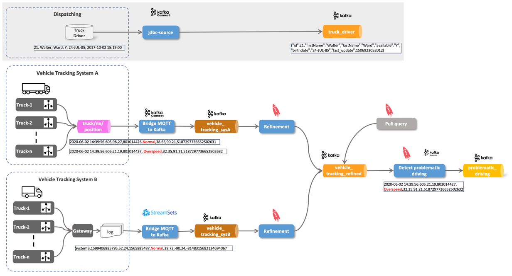

Usaremos el Kafka Connect [Conector de origen JDBC](https://www.confluent.io/hub/confluentinc/kafka-connect-jdbc) para recuperar periódicamente los datos de la tabla de la base de datos y publicarlos en el tema Kafka `logisticsdb_driver`. El conector está preinstalado como parte de la plataforma de datos.

En lugar de configurar el conector a través de la API REST, como hemos visto antes con el conector MQTT, utilizaremos la integración ksqlDB con el [CREAR CONECTOR](https://docs.ksqldb.io/en/latest/developer-guide/ksqldb-reference/create-connector/) mandar.

Primero vamos a crear el tema de Kafka `logisticsdb_driver`.

```bash
docker exec -it kafka-1 kafka-topics --zookeeper zookeeper-1:2181 --create --topic logisticsdb_driver --partitions 8 --replication-factor 3 --config cleanup.policy=compact --config segment.ms=100 --config delete.retention.ms=100 --config min.cleanable.dirty.ratio=0.001
```

Ahora en el shell de ksqlDB configure los siguientes ajustes

```sql
set 'commit.interval.ms'='5000';
set 'cache.max.bytes.buffering'='10000000';
set 'auto.offset.reset'='earliest';
```

y cree el conector ([CREAR CONECTOR](https://docs.ksqldb.io/en/latest/developer-guide/ksqldb-reference/create-connector/))

```sql
DROP CONNECTOR jdbc_logistics_sc;
```

```sql
CREATE SOURCE CONNECTOR jdbc_logistics_sc WITH (
    "connector.class"='io.confluent.connect.jdbc.JdbcSourceConnector',
    "tasks.max" = '1',
    "connection.url" = 'jdbc:postgresql://postgresql/demodb?user=demo&password=abc123!',
    "mode" = 'timestamp',
    "timestamp.column.name" = 'last_update',
    "schema.pattern" = 'logistics_db',
    "table.whitelist" = 'driver',
    "validate.non.null" = 'false',
    "topic.prefix" = 'logisticsdb_',
    "poll.interval.ms" = '10000',
    "key.converter" = 'org.apache.kafka.connect.converters.LongConverter',
    "key.converter.schemas.enable" = 'false',
    "value.converter" = 'org.apache.kafka.connect.json.JsonConverter',
    "value.converter.schemas.enable" = 'false',
    "transforms" = 'createKey,extractInt',
    "transforms.createKey.type" = 'org.apache.kafka.connect.transforms.ValueToKey',
    "transforms.createKey.fields" = 'id',
    "transforms.extractInt.type" = 'org.apache.kafka.connect.transforms.ExtractField$Key',
    "transforms.extractInt.field" = 'id'
    );
```

podemos ver que todos los controladores de la `driver` tabla se han producido en el `logisticsdb_driver` tema mediante el uso de `kcat`:

```bash
docker exec -ti kcat kcat -b kafka-1 -t logisticsdb_driver -o beginning
```

También puede utilizar el `print` comando de ksqlDB en su lugar

```sql
print logisticsdb_driver
```

En la consola de ksqlDB, cree una tabla ksqlDB sobre el tema

```sql
DROP TABLE IF EXISTS driver_t;

CREATE TABLE IF NOT EXISTS driver_t (id BIGINT PRIMARY KEY,
   first_name VARCHAR,  
   last_name VARCHAR,  
   available VARCHAR, 
   birthdate VARCHAR)  
  WITH (kafka_topic='logisticsdb_driver', 
        value_format='JSON');
```

```sql
SELECT * FROM driver_t EMIT CHANGES;
```

Ahora realice una actualización en uno de los controladores de la base de datos PostgreSQL (origen original):

```sql
docker exec -ti postgresql psql -d demodb -U demo -c "UPDATE logistics_db.driver SET available = 'N', last_update = CURRENT_TIMESTAMP  WHERE id = 11"
```

## Paso 8 - Unirse con el controlador ("información estática")

En esta parte del taller, nos unimos a la `driver` Tabla ksqlDB con el `problematic_driving_s` flujo ksqlDB para enriquecerlo con información valiosa.

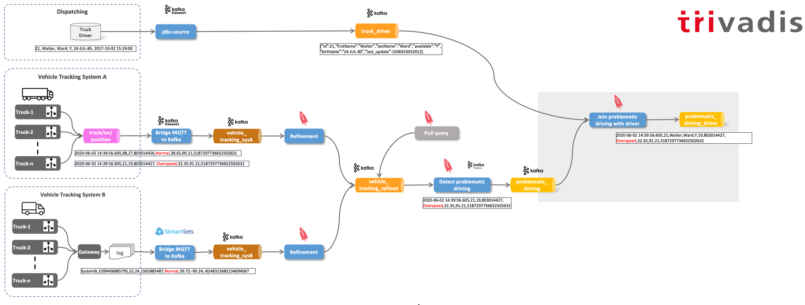

Ahora con la tabla ksqlDB en su lugar, unámosla con el `problematic_driving_s` Flujo ksqlDB para enriquecerlo con la información del controlador disponible en el `driver_t` tabla (first_name, last_name y disponibilidad):

```sql
SELECT pd.driverId, d.first_name, d.last_name, d.available, pd.vehicleId, pd.routeId, pd.eventType 
FROM problematic_driving_s 	pd
LEFT JOIN driver_t 				d
ON pd.driverId  = d.id
EMIT CHANGES;
```

Podemos ver que la unión parece que ha sido tomada de un sistema basado en RDMBS. La transmisión enriquecida se puede ver apareciendo en vivo en la CLI de ksqlDB.

¿Cómo podemos hacer que ese conjunto de datos enriquecido (flujo de datos) esté disponible de una manera más permanente? Lo hacemos creando un nuevo Stream basado en la declaración SELECT que se acaba de emitir. Detenga la consulta escribiendo `CTRL-C` y ejecute la siguiente instrucción:

```sql
DROP STREAM IF EXISTS problematic_driving_and_driver_s;
```

```sql
CREATE STREAM IF NOT EXISTS problematic_driving_and_driver_s \
  WITH (kafka_topic='problematic_driving_and_driver', \
        value_format='AVRO', \
        partitions=8) \
AS 
SELECT pd.driverId, d.first_name, d.last_name, d.available, pd.vehicleId, pd.routeId, pd.eventType 
FROM problematic_driving_s 	pd
LEFT JOIN driver_t 				d
ON pd.driverId  = d.id;
```

podemos usar `kcat` Para mostrar el flujo de datos en el tema kafka recién creado `problematic_driving_and_driver_ksql` para mostrar el enriquecimiento en acción:

```bash
docker exec -ti kcat kcat -b kafka-1 -t problematic_driving_and_driver -s value=avro -r http://schema-registry-1:8081
```

## Paso 9 - Comportamiento de conducción agregado

En esta parte del taller, estamos utilizando los operadores de agregados `count` para realizar agregaciones a lo largo de ventanas de tiempo.

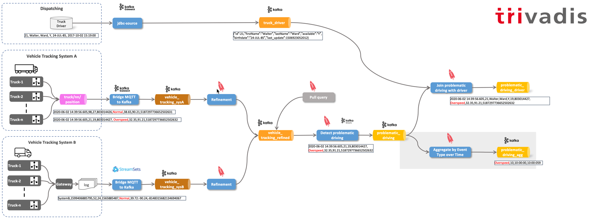

La primera es una ventana de caída de 1 hora

```sql
DROP TABLE IF EXISTS event_type_by_1hour_tumbl_t DELETE TOPIC;
```

```sql
CREATE TABLE event_type_by_1hour_tumbl_t AS
SELECT windowstart AS winstart
	, windowend 	AS winend
	, eventType
	, count(*) 	AS nof 
FROM problematic_driving_s 
WINDOW TUMBLING (SIZE 60 minutes)
GROUP BY eventType;
```

El segundo es una ventana de caída de 1 hora con un tobogán de 30 minutos.

```sql
CREATE TABLE event_type_by_1hour_hopp_t AS
SELECT windowstart AS winstart
	, windowend 	AS winend
	, eventType
	, count(*) 	AS nof 
FROM problematic_driving_s 
WINDOW HOPPING (SIZE 60 minutes, ADVANCE BY 30 minutes)
GROUP BY eventType;
```

Si está haciendo una selección en la tabla, puede dar formato a los elementos de tiempo de la ventana de tiempo como se muestra a continuación

    SELECT TIMESTAMPTOSTRING(WINDOWSTART,'yyyy-MM-dd HH:mm:SS','CET') wsf
    , TIMESTAMPTOSTRING(WINDOWEND,'yyyy-MM-dd HH:mm:SS','CET') wef
    , ws
    , we
    , eventType
    , nof
    FROM event_type_by_1hour_tumbl_t
    WHERE ws > UNIX_TIMESTAMP()-300001 and ws < UNIX_TIMESTAMP()- 240001
    EMIT CHANGES;

## Paso 10 - Materializar la información de envío ("información estática")

En esta parte del taller estamos integrando el `shipment` información del sistema de envío en un tema de Kafka, por lo que está disponible para analíticos.

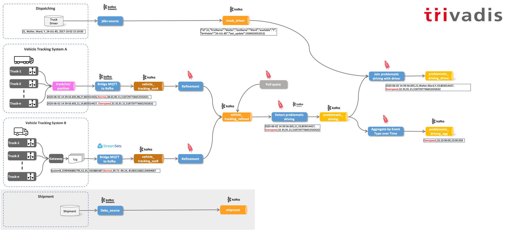

Usaremos el Kafka Connect [Debezium MySQL CDC Source Connector](https://www.confluent.io/hub/debezium/debezium-connector-mysql) Para supervisar y registrar todos los cambios de nivel de fila en el cuadro de diálogo `shipment` tabla de base de datos y publíquela en el tema Kafka `sample.sample.shipment` (implementación de la captura de datos de cambios basada en registros). El conector está preinstalado como parte de la plataforma de datos.

Estamos de nuevo utilizando el [CREAR CONECTOR](https://docs.ksqldb.io/en/latest/developer-guide/ksqldb-reference/create-connector/) para configurar el conector en lugar de la API de REST.

Primero vamos a crear el nuevo tema de Kafka

```bash
docker exec -it kafka-1 kafka-topics --zookeeper zookeeper-1:2181 --create --topic sample.sample.shipment --partitions 8 --replication-factor 3
```

Alternativamente, también podría crearse como un tema de registro compactado

```bash
docker exec -it kafka-1 kafka-topics --zookeeper zookeeper-1:2181 --create --topic sample.sample.shipment --partitions 8 --replication-factor 3 --config cleanup.policy=compact --config segment.ms=100 --config delete.retention.ms=100 --config min.cleanable.dirty.ratio=0.001
```

Ahora podemos crear el conector

```sql
DROP CONNECTOR debz_shipment_sc;

CREATE SOURCE CONNECTOR debz_shipment_sc WITH (
    'connector.class' = 'io.debezium.connector.mysql.MySqlConnector',
    'database.hostname' = 'mysql',
    'database.port' = '3306',
    'database.user' = 'debezium',
    'database.password' = 'dbz',
    'database.server.id' = '42',
    'database.server.name' = 'sample',
    'table.whitelist' = 'sample.shipment',
    'database.history.kafka.bootstrap.servers' = 'kafka-1:19092',
    'database.history.kafka.topic' = 'dbhistory.sample' ,
    'schema_only_recovery' = 'true',
    'include.schema.changes' = 'false',
    'transforms'= 'unwrap, extractkey',
    'transforms.unwrap.type'= 'io.debezium.transforms.ExtractNewRecordState',
    'transforms.extractkey.type'= 'org.apache.kafka.connect.transforms.ExtractField$Key',
    'transforms.extractkey.field'= 'id',
    'key.converter'= 'org.apache.kafka.connect.storage.StringConverter',
    'value.converter'= 'io.confluent.connect.avro.AvroConverter',
    'value.converter.schema.registry.url'= 'http://schema-registry-1:8081'
    );
```

Ahora vamos a crear la tabla ksqlDB correspondiente

```sql
DROP TABLE IF EXISTS shipment_t;

CREATE TABLE IF NOT EXISTS shipment_t (id VARCHAR PRIMARY KEY,
   vehicle_id INTEGER,  
   target_wkt VARCHAR)  
  WITH (kafka_topic='sample.sample.shipment', 
        value_format='AVRO');
```

Y use una selección para probar que está funcionando

```sql
SELECT * FROM shipment_t EMIT CHANGES;
```

Si realiza una actualización en MySQL, debería ver un cambio inmediatamente

```sql
UPDATE shipment SET target_wkt = 'POLYGON ((-91.0986328125 38.839707613545144, -90.87890625 38.238180119798635, -90.263671875 38.09998264736481, -89.75830078125 38.34165619279595, -89.36279296875 38.66835610151506, -89.5166015625 38.95940879245423, -89.93408203124999 39.11301365149975, -90.52734374999999 39.18117526158749, -91.0986328125 38.839707613545144))', update_ts = CURRENT_TIMESTAMP;
```

## Paso 11 - Geo-Cercado para el destino "cercano" (por terminar)

En esta parte del taller estamos utilizando el `shipment` información para detectar cuando un vehículo está cerca del destino del envío.

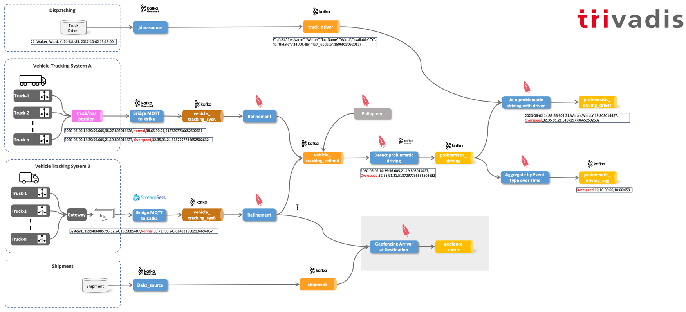

Para eso hemos implementado algunas funciones adicionales definidas por el usuario (UDF) que pueden ser demandadas de la misma manera que los funcitons incorporados de ksqlDB.

```sql
show functions;
```

```sql
DROP TABLE IF EXISTS shipment_by_vehicle_t;

CREATE TABLE shipment_by_vehicle_t
AS SELECT vehicle_id, collect_list(target_wkt) AS target_wkts
FROM shipment_t
GROUP BY vehicle_id;
```

```sql
SELECT vtr.vehicleId
		,array_lag(collect_list(geo_fence(vtr.latitude, vtr.longitude, sbv.target_wkts[1])),1) AS status_before
		,array_lag(collect_list(geo_fence(vtr.latitude, vtr.longitude, sbv.target_wkts[1])),0) AS status_now
FROM vehicle_tracking_refined_s	vtr
LEFT JOIN shipment_by_vehicle_t	sbv
ON CAST (vtr.vehicleId AS INTEGER) = sbv.vehicle_id
WHERE sbv.target_wkts IS NOT NULL
GROUP BY vehicleId
EMIT CHANGES;
```

```sql
CREATE TABLE geo_fence_status_t AS
SELECT vtr.vehicleId
		, geo_fence (array_lag(collect_list(geo_fence(vtr.latitude, vtr.longitude, sbv.target_wkts[1])),1) ,
					array_lag(collect_list(geo_fence(vtr.latitude, vtr.longitude, sbv.target_wkts[1])),0) 
					) AS status
FROM vehicle_tracking_refined_s	vtr
LEFT JOIN shipment_by_vehicle_t	sbv
ON CAST (vtr.vehicleId AS INTEGER) = sbv.vehicle_id
WHERE sbv.target_wkts IS NOT NULL
GROUP BY vehicleId
EMIT CHANGES;
```

```sql
SELECT vehicleId, geo_fence(array_lag(collect_list(geo_fence(latitude, longitude, 'POLYGON ((-90.626220703125 38.80118939192329, -90.62347412109375 38.460041065720446, -90.06866455078125 38.436379603, -90.04669189453125 38.792626957868904, -90.626220703125 38.80118939192329))')),1), array_lag(collect_list(geo_fence(latitude, longitude, 'POLYGON ((-90.626220703125 38.80118939192329, -90.62347412109375 38.460041065720446, -90.06866455078125 38.436379603, -90.04669189453125 38.792626957868904, -90.626220703125 38.80118939192329))')),0)) status FROM vehicle_tracking_refined_s group by vehicleId EMIT CHANGES;
```

## Paso 12 - Integración del panel (por finalizar)

Primero vamos a crear una secuencia respaldada por el `dashboard` , que será el canal a la solución de panel de Control de Tipboard.

```sql
DROP STREAM IF EXISTS dashboard_s;
```

```sql
CREATE STREAM IF NOT EXISTS dashboard_s
  (ROWKEY BIGINT KEY,
   tile VARCHAR,
   key VARCHAR, 
   data VARCHAR)
  WITH (kafka_topic='dashboard'
  		, partitions=1
       , value_format='JSON');
```

Ahora importe el conector StreamSets entre esta nueva secuencia y el panel de Tipboard.

### Controladores problemáticos

```sql
SELECT first_name, last_name, eventType
FROM problematic_driving_and_driver_s
EMIT CHANGES;
```

    CREATE STREAM tipboard_text_s 
    WITH (value_format = 'JSON', kafka_topic = 'tipboard_text_s', partitions=1)
    AS
    SELECT driverId AS ROWKEY
    	   , 'text' AS tile
    		, 'tweet' AS key
    		, tipboard_text(concat(first_name, ' ', last_name, ' ', eventType)) AS data
    FROM problematic_driving_and_driver_s
    EMIT CHANGES;

### Geo Cerca

```sql
DROP STREAM geo_fence_status_s;

CREATE STREAM geo_fence_status_s (vehicleId STRING KEY
												, status STRING)
WITH (kafka_topic='GEO_FENCE_STATUS_T'
					, partitions=8
					, value_format='AVRO');
```

    INSERT INTO dashboard_s
    SELECT CAST (vehicleId AS BIGINT) AS ROWKEY
    		, 'text' AS tile
    		, 'tweet' AS key
    		, tipboard_text(concat('Vehicle ', vehicleId, ' is near its destination')) AS data
    FROM geo_fence_status_s
    WHERE status = 'ENTERING'
    PARTITION BY CAST (vehicleId AS BIGINT)
    EMIT CHANGES;

### Gráfico circular

```sql
DROP STREAM event_type_by_1hour_tumbl_s;

CREATE STREAM event_type_by_1hour_tumbl_s (eventType STRING KEY
												, winstart BIGINT
												, winend BIGINT
												, nof BIGINT)
WITH (kafka_topic='event_type_by_1hour_tumbl_t'
					, partitions=8
					, value_format='AVRO'
					, window_type='Tumbling'
					, window_size='60 minutes');

SELECT winstart
		, collect_list(eventType) 
		, collect_list(nof) 
FROM  event_type_by_1hour_tumbl_s 
GROUP BY winstart
EMIT CHANGES;

SELECT winstart, as_map(collect_list(eventType), collect_list(nof) ) as counts
FROM  event_type_by_1hour_tumbl_s 
GROUP BY winstart
EMIT CHANGES;

DROP TABLE tipboard_pie_t DELETE TOPIC;

CREATE TABLE tipboard_pie_t 
WITH (value_format = 'JSON', kafka_topic = 'tipboard_pie_t', partitions=1)
AS
SELECT winstart
		, 'pie_chart' AS tile
		, 'pie' AS key
		, tipboard_pie_chart('Last Hour', as_map(collect_list(eventType), collect_list(nof) )) as data
FROM  event_type_by_1hour_tumbl_s 
GROUP BY winstart
EMIT CHANGES;


```
